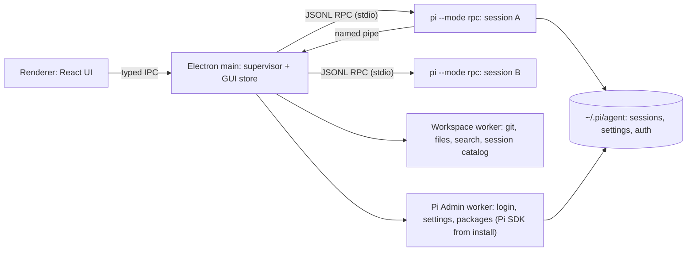
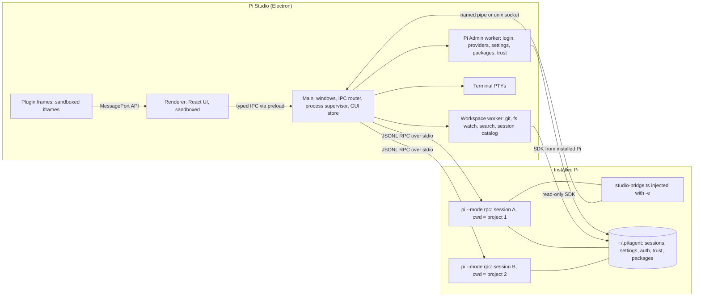
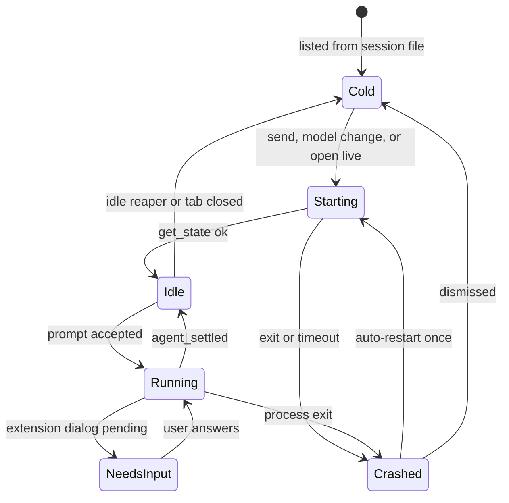

<!-- SUMMARY -->
# Pi Studio — Agentic Coding GUI on top of the Pi CLI (Executive Summary)

> [!NOTE]
> **Executive Summary**: A desktop app (Electron + React + TypeScript) that drives the **installed Pi CLI** in RPC mode — one `pi --mode rpc` process per *active* session — plus a tiny injected **Studio Bridge** Pi extension for GUI-only powers (linked projects, tree navigation, rich extension panels) and a helper worker that uses **Pi's own SDK from the same install** for login, settings, packages and the session catalog. Every panel, renderer, file viewer, theme and marketplace source goes through contribution registries from day one. The risky integration points were **already spiked on this machine** (see `spikes/README.md`). Rough effort: ~16–18 weeks to v1 for one dev with agents; first usable chat build in ~2 weeks. *"Pi Studio" is a working name.*

## What you asked for → how the plan delivers it

| You asked for | Plan |
|---|---|
| Pi CLI under the hood, Pi extensions from the start | `pi --mode rpc` per session; extension dialogs / status / widgets rendered natively; injected bridge for rich GUI hooks |
| Model picker over every subscription (extensions can add/modify) | Live list from Pi itself — on this machine **37 models**: anthropic 16, **antigravity 14 (added by the `pi-antigravity` extension)**, zai 7 |
| Left sidebar: projects (repos) → sessions | Pi session catalog grouped by project; imports your existing **99 sessions / 11 folders** |
| Linked projects (path picker, Finder/Explorer) | Native folder picker; injected live as a `<linked_projects>` system-prompt section (**proven in spike**) + file tree and `@`-mentions across linked roots |
| Top tabs across projects, color-coded, changeable colors | Session tabs tinted with the project color (auto-assigned OKLCH palette, editable) |
| Composer: text, files, photos, model, thinking level, context size | + `/` commands, `@` files, steer vs queue, per-model context-limit override |
| Context ring (current/total) + click for breakdown | Exact total from Pi + estimated split: system prompt, tools, AGENTS.md, skills, linked projects, messages, each tool result |
| Dockable/undockable icon widgets on left and right | Icon bars on both edges, drag widgets between sides, float or pop out, saved named layouts |
| Arc-browser-like color picker for the whole window | 1–3 color picker + intensity + grain + light/dark/auto → contrast-safe palette over the entire UI, Mica/vibrancy |
| Git window (branches, current branch) + staged/unstaged | Branches, stage/unstage/discard, diff, commit/amend, push/pull, AI commit message, per-turn "what the agent changed" |
| File window + nice per-language inspection | File tree + pluggable viewers: code, markdown, images, PDF, CSV, JSON, notebooks, run-with-interpreter |
| Everything extensible + marketplace of marketplaces | Plugin API + marketplace sources: **Pi packages (npm `pi-package`, ~10.9k)**, **Claude Code plugin marketplaces** (e.g. `anthropics/claude-plugins-official`, 314 plugins), **MCP Registry**, custom catalogs |

## Architecture at a glance



## Key Decisions

> [!CHOICE] D1 — How the GUI drives Pi
> **Question**: Which integration architecture should we build on?
> - (x) **Option B**: `pi --mode rpc` per active session + injected Studio Bridge extension + Pi Admin worker using the SDK from the installed Pi (crash isolation, native login, live linked projects, tree navigation) [Recommended]
> - ( ) **Option A**: Plain RPC only (simplest; login via an embedded terminal running `/login`; linked projects fixed at spawn; no in-place branching)
> - ( ) **Option C**: Pi SDK in one shared host process (lowest memory, full API; one bad extension freezes every session; tighter coupling to Pi internals)

> [!CHOICE] D2 — Desktop shell
> **Question**: Which desktop runtime?
> - (x) **Option A**: Electron + React + TypeScript + Vite — Node built in (Pi SDK, node-pty, file watchers), identical Chromium rendering on Windows and macOS [Recommended]
> - ( ) **Option B**: Tauri 2 — smaller binary, but still needs a Node sidecar for Pi, plus Rust and two webview engines

> [!CHOICE] D3 — Which Pi binary runs underneath
> **Question**: Where does Pi come from?
> - (x) **Option A**: Your installed `pi` (auto-detected, path overridable, minimum version gate 0.87) — same version, extensions and sessions as your terminal [Recommended]
> - ( ) **Option B**: A bundled, pinned Pi inside the app (zero setup, but two Pi versions writing the same `~/.pi/agent`)
> - ( ) **Option C**: Installed Pi, with a bundled fallback when none is found

> [!CHOICE] D4 — GUI plugin runtime (public API shape, hard to change later)
> **Question**: How do third-party GUI plugins run?
> - (x) **Option A**: Sandboxed iframes + async MessagePort API with permissions; built-in panels use the same service API [Recommended]
> - ( ) **Option B**: Trusted React modules loaded straight into the renderer (fastest to build, no isolation)
> - ( ) **Option C**: No GUI plugins in v1 — only Pi extensions (text widgets and status)

> [!CHOICE] D5 — Audience
> **Question**: Who is v1 for?
> - (x) **Option A**: Personal power tool first, with product-ready architecture (signing, auto-update and telemetry deferred) [Recommended]
> - ( ) **Option B**: Public product from v1 (code signing, notarization, auto-update, crash reporting, onboarding docs)

> [!QUESTION] Q1 — Ideas you may have missed
> **Question**: I tiered the extra ideas from the web research (table below). Move anything between tiers, or drop any?

> [!QUESTION] Q2 — Name
> **Question**: Keep "Pi Studio" as the working name, or do you have a name in mind?

### Ideas from research (tiered)

| Tier | Ideas (seen in pi-gui, pi-web, opcode, cc-haha, CodePilot, Conductor-style tools) |
|---|---|
| **Tier 1 — in v1** | Project-trust dialog (**required**: RPC cannot show Pi's trust prompt) · Command palette ⌘K + quick open ⌘P · Integrated terminal · OS notifications + tab badges when a background run finishes or needs input · Full-text search across all sessions · **Per-turn checkpoints: "review what this turn changed" + revert turn** · Extension console (errors) + diagnostics page |
| **Tier 2 — v1.x** | Git worktree per session (parallel agents on one repo) · Approval / permission modes (ask before bash or writes) · Usage & cost dashboard incl. subscription quota · Split view (2 sessions side by side) · Session tree navigator · Scheduled / recurring prompts · AGENTS.md / context-file editor · Presets & prompt library UI |
| **Tier 3 — later** | Built-in browser preview · Phone / remote companion · Voice input · Kanban task board · Multi-agent orchestration canvas · Provider request trace inspector · LSP-powered editing · Chat-app bridges (Telegram, Slack) |

## Execution Milestones
- [x] 0. Spikes on this machine: RPC, bridge, SDK-from-install, native login, offline fake provider (done)
- [ ] 1. Walking skeleton: one session, streaming transcript, composer, model/thinking pickers, context ring, extension UI, dock shell
- [ ] 2. Projects, sessions and color-coded tabs (import existing Pi history, lazy processes, trust dialog, notifications)
- [ ] 3. Arc-style theme engine + docking polish (float, pop-out, saved layouts)
- [ ] 4. Files, viewers, terminal
- [ ] 5. Git window + per-turn checkpoints
- [ ] 6. Context inspector + linked projects
- [ ] 7. Accounts/login, settings, marketplace
- [ ] 8. GUI plugin API v0 + example plugin
<!-- /SUMMARY -->

<!-- FULL -->
# Pi Studio — Full Specification

> [!IMPORTANT]
> **Core invariants**
> 1. **Pi is the only writer of Pi data.** Sessions, settings, auth, trust and packages are changed only by Pi processes or Pi's own managers (which take file locks). The GUI never hand-writes a session file, so every session stays resumable in the terminal.
> 2. **No untrusted code in the Electron main process or the renderer.** Pi extensions run inside `pi` processes; GUI plugins run in sandboxed frames.
> 3. **Everything user-visible is a contribution.** Built-in panels, tool renderers, file viewers, commands and marketplace sources register through the same registries that third parties will use.

## 0. Depth calibration

**Cross-cutting, full workflow.** This is a new product with public interfaces (the bridge protocol and the plugin API), persisted data and several new dependencies.

## 1. Objective & Background

Build a desktop GUI for agentic coding where **Pi remains the agent**: its loop, tools, providers, sessions, extensions and packages. The GUI adds multi-project and multi-session navigation, rich rendering, docking, theming, git, files, a context inspector and a marketplace.

Relevant facts about Pi (0.87.1, installed at `C:\Users\Adiel\AppData\Local\pi-node\current`):
- Pi officially supports GUIs through **RPC mode**, described as being for "process isolation, IDEs, and custom user interfaces". It also offers an in-process **SDK**.
- The Pi ecosystem already has several GUIs (pi-gui on the SDK, gustavonline/pi-desktop on RPC, pi-web as a web UI, PI-Desktop with plugins). They were mined for ideas (Tier table in the Summary) and for evidence about which architecture holds up.
- Your setup relies on extensions for exactly the things the GUI must support. `pi-antigravity` adds the Antigravity provider and `@gotgenes/pi-anthropic-auth` adds Anthropic OAuth. Your status items come from extensions too: quota, preset and plan-mode.

## 2. Requirements & Non-Goals

### 2.1 Functional requirements

| ID | Requirement |
|---|---|
| FR-1 | Run agent sessions through the Pi CLI. Pi extensions, skills, prompts, themes and packages load unchanged. Extension UI works: dialogs, notifications, status, widgets, title, editor text. |
| FR-2 | Model picker covering every provider Pi exposes, including providers added or changed by extensions. Anthropic and Antigravity are first-class. Login and logout come from the GUI. |
| FR-3 | Thinking-level picker limited to the levels the current model supports. |
| FR-4 | Context-size control where possible (a per-model context-limit override) and a live **context ring** (used/total). Clicking it opens a breakdown of what fills the context. |
| FR-5 | Left sidebar: projects (folders or repos) → their sessions. Add a project through the native folder picker. Import existing Pi history. |
| FR-6 | **Linked projects** per project: add paths with the native picker. The agent is told about them and can read them. The file tree and `@`-mentions include them. |
| FR-7 | Top tab bar of open sessions from any project, color-coded by project. Each project gets an auto-assigned color that the user can change. |
| FR-8 | Center: live session transcript (streaming text, thinking, tool calls, results, errors, queue). |
| FR-9 | Bottom composer: text, file attachments, pasted or dropped images, `/` commands, `@` files, send / steer / queue / stop. |
| FR-10 | Left and right icon bars with dockable widgets: drag between sides, float or pop out, resize, collapse, save layouts. |
| FR-11 | Arc-browser-like theming of the whole window: 1–3 colors, intensity, grain, light/dark/auto, presets. |
| FR-12 | Git widget: current branch, ahead/behind, branch list and switch/create, staged vs unstaged vs untracked, stage/unstage/discard, diff, commit, push/pull/fetch. |
| FR-13 | File widget: tree, search, and opening a file in the right viewer for its type (syntax-highlighted code, rendered docs and media, data grids, run-with-interpreter). |
| FR-14 | Extensibility everywhere: GUI plugin API plus a marketplace that can aggregate multiple marketplace sources (Pi packages, Anthropic/Claude plugin marketplaces, MCP registry, custom). |

### 2.2 Non-functional requirements

| Area | Target | Source / reasoning |
|---|---|---|
| Scale | 10–50 projects, 100–5,000 sessions, **≤ 8 concurrently running sessions** typical | Today: 99 sessions across 11 folders (`spikes/sessions-spike.mjs`) |
| Latency | UI actions < 100 ms. Tab switch to a live session < 150 ms. Cold-open a 1k-entry session from file < 500 ms. New session usable < 3 s (Pi startup measured at **2.1–2.9 s**, hidden by a warm spare process). Streaming painted in ≤ 50 ms batches at 60 fps | `spikes/spike.mjs`; pi-gui batches streaming at 50 ms per session |
| Memory | ~106 MB per live Pi process. Idle processes reaped after 10 min. Cold tabs render from file with no process | `spikes/spike.mjs`; pi-web's default idle timeout is 600,000 ms |
| Consistency | Pi files are the source of truth. The GUI keeps only derived caches. **Single writer per session file**, enforced by the GUI because Pi does not lock session files | Pi locks settings and auth (`settings-manager.js:70`, `auth-storage.js:85`) but not sessions (0 lockfile refs in `session-manager.js`) |
| Security | Renderer is sandboxed (contextIsolation, no Node). Secrets never reach the renderer. Plugin frames have an opaque origin with a per-plugin CSP. File viewers only open registered roots. The trust decision is explicit | `docs/security.md:19,75` |
| Observability | Per-process stderr logs rotate into app data. `extension_error` events feed an Extension Console. A diagnostics page shows Pi version/path, process list, memory and bridge status | `docs/json.md:190` |
| Maintenance | Pi ships weekly (0.86.0 → 0.87.1 in 3 days) with breaking changes (`CHANGELOG.md:35,97`). Contract tests run against the installed Pi, and all Pi coupling sits in one adapter package | `CHANGELOG.md` |
| Compatibility | Sessions, settings, auth, trust and packages are shared with the terminal Pi in both directions | FR-1 |
| Cost | Local only, no servers. Marketplace calls go to the npm registry and GitHub (unauthenticated GitHub allows 60 req/h, so catalogs are cached and an optional token is supported) | — |

### 2.3 Non-Goals (v1)

- **No re-implementation of agent logic**: no custom agent loop, tools or providers in the GUI.
- **Not a full IDE.** The file viewer reads first and edits lightly; no debugger, no refactoring, no LSP editing in v1.
- **No direct writes to Pi session files** (invariant 1).
- **No cloud backend**: no accounts, sync, telemetry server or remote/mobile access in v1.
- **No full Claude Code plugin parity.** Import skills and commands; agents and MCP only through existing Pi adapter packages; hooks unsupported.
- **No sandboxing of Pi itself.** The OS user is the security boundary, as Pi documents. Container mode may come later.
- **No team or multi-user features.**

### 2.4 Assumptions (blast radius if wrong)

| # | Assumption | If wrong |
|---|---|---|
| A1 | You keep an installed Pi ≥ 0.87 | Add the bundled fallback (D3 option C). **Low** |
| A2 | Pi's RPC protocol stays backward compatible within minor versions. It is the documented, supported API (`CHANGELOG.md:188`) | Adapter changes. **Medium** |
| A3 | A running RPC process can pick up a new login without restarting (via the bridge calling `ctx.modelRegistry.refresh()`) | Restart idle processes after login. **Low** (verify in Slice 1) |
| A4 | ≤ 8 sessions run at once | At 20 or more, move idle sessions to a shared SDK host (Option C for idle only). **Medium** |
| A5 | FlexLayout's border tabsets give the left/right icon-bar UX | Swap the library behind the layout adapter. **Low–Medium** |
| A6 | Windows 11 and macOS 14+ are the targets; Linux is best effort | Packaging work only. **Low** |

## 3. Evidence

> [!TIP]
> Every current-state claim below cites a file and line in the installed Pi (`…/node_modules/@earendil-works/pi-coding-agent/`), your config, or a spike script in `spikes/`.

<details>
<summary><b>Pi integration surface (docs + type declarations)</b></summary>

| Claim | Citation |
|---|---|
| RPC is for "process isolation, IDEs, and custom user interfaces" | `docs/rpc.md:3` |
| Framing: split on LF only. Node `readline` is unsafe because it also splits on U+2028/U+2029 | `docs/rpc.md:54` |
| `agent_settled` means "Pi will not continue automatically" | `docs/rpc.md:67` |
| Shut down by closing stdin | `docs/rpc.md:91` |
| Prompting while streaming requires `streamingBehavior` (`steer` / `followUp`) | `docs/rpc-commands.md:20` |
| Esc behavior: `clear_queue` then `abort`, then restore the text | `docs/rpc-commands.md:122` |
| Model list command; thinking levels `off…max` | `docs/rpc-commands.md:246`, `:276` |
| `contextUsage` is the same estimate Pi uses for compaction and its footer | `docs/rpc-commands.md:559` |
| `get_entries` with a `since` entry id is a durable cursor across client restarts | `docs/rpc-commands.md:685` |
| Fork, switch session | `docs/rpc-commands.md:604`, `:586` |
| Built-in TUI commands (`/settings`, `/login`…) are **not** available over RPC | `docs/rpc-commands.md:828` |
| RPC command union has no login, settings or package commands | `dist/modes/rpc/rpc-types.d.ts:16–135` |
| Extension dialogs are a request/response subprotocol | `docs/rpc-extension-ui.md:7` |
| `custom()` returns `undefined` in RPC; widgets are string arrays only | `docs/rpc-extension-ui.md:16`, `:144` |
| Extensions should guard TUI-only code with `ctx.mode === "tui"` | `docs/rpc-extension-ui.md:25`, `docs/extensions.md:192` |
| Wire `message_update` records are delta-only | `docs/json.md:72` |
| `queue_update` carries the full queue; `extension_error` event exists | `docs/json.md:121`, `:190` |
| RPC cannot show the trust prompt → the GUI must decide | `docs/security.md:75` |
| The cwd does not confine tools, so linked paths are readable | `docs/security.md:19` |
| Session file location and grouping by cwd | `docs/session-format.md:11` |
| The system message persists prompt **sections by name** | `docs/session-format.md:80` |
| Context edits exist (`context_edit`) | `docs/session-format.md:137` |
| `pi-package` keyword drives the gallery; `pi.image`/`pi.video` give previews | `docs/packages.md:74` |
| Install sources and `--local` scope | `docs/packages.md:12`, `:19` |
| `modelOverrides` for built-in and extension models | `docs/models.md:66` |
| `enabledModels`, `compaction.reserveTokens`, `defaultProjectTrust` | `docs/settings.md:16`, `:55`, `:34` |
| Extensions: `pi.events` bus, `registerProvider` | `docs/extensions.md:84`, `:82` |
| Experimental server/client exist but are source-only; **SDK + stdio RPC are the supported API** | `CHANGELOG.md:188` |
| Breaking changes happen in minor releases | `CHANGELOG.md:35`, `:97` |
| `ModelRuntime.login(providerId, type, interaction)` and `getProviderAuthStatus` | `dist/core/model-runtime.d.ts:94`, `:85` |
| Extension context gets `ModelRegistry` (no login) | `dist/core/extensions/types.d.ts:222` |
| Command-only `navigateTree` and `reload` | `dist/core/extensions/types.d.ts:1380`, `:1393` |
| `ExtensionMode = "tui" \| "rpc" \| "json" \| "print"` | `dist/core/extensions/types.d.ts:209` |
| `systemPromptOptions.sections` (XML-wrapped named sections) | `dist/core/system-prompt.d.ts:21` |
| `SessionManager.list/listAll`, `SessionInfo` | `dist/core/session-manager.d.ts:399`, `:404`, `:163` |
| `PackageManager.installAndPersist` | `dist/core/package-manager.d.ts:44` |
| `estimateTokens`, `calculateContextTokens` | `dist/core/compaction/compaction.d.ts:64`, `:38` |
| Settings and auth writes are file-locked | `dist/core/settings-manager.js:70`, `dist/core/auth-storage.js:85` |
| `ProjectTrustStore`, `hasTrustRequiringProjectResources` exported | `dist/index.d.ts:26` |
| `RpcClient.getAvailableModels()` returns a *stripped* `ModelInfo` (no `input`/cost), so we use our own client | `dist/modes/rpc/rpc-client.d.ts:119` |
| Pi's `fauxProvider` (scripted offline model) is exported by pi-ai | `node_modules/@earendil-works/pi-ai/dist/providers/faux.d.ts:102` |

</details>

<details>
<summary><b>Your configuration (what must keep working)</b></summary>

| Fact | Citation |
|---|---|
| Default provider is `antigravity` | `~/.pi/agent/settings.json:3` |
| Favorites are `enabledModels` (Opus 5.5, Sonnet 5, Gemini 3.7/3.8 Flash) | `~/.pi/agent/settings.json:5` |
| Packages: `@gotgenes/pi-anthropic-auth`, `pi-antigravity`, `pi-quota-status` | `~/.pi/agent/settings.json:11–13` |
| A context-window override is already used (`providers.anthropic.modelOverrides`) | `~/.pi/agent/settings.json:19` |
| Antigravity is an extension-registered OAuth provider | `npm/node_modules/pi-antigravity/src/index.ts:105` |
| `questionnaire` uses TUI-only `ctx.ui.custom()`, so it degrades in RPC | `~/.pi/agent/extensions/questionnaire.ts:231` |
| `confirm-exit` uses TUI-only `setEditorComponent` (no-op in RPC) | `~/.pi/agent/extensions/confirm-exit.ts:27` |
| Trust decisions shared with the CLI | `~/.pi/agent/trust.json` |

</details>

<details>
<summary><b>Spike results (Slice 0, run today, scripts in <code>spikes/</code>)</b></summary>

| Spike | Result |
|---|---|
| `spike.mjs` | First RPC response in **2.1–2.9 s**; **~106 MB** idle; **37 models** (antigravity 14 from the extension); 40 commands; extension `setStatus`/`setWidget` arrive at startup |
| `bridge-spike.mjs` + `bridge.ts` | `-e bridge.ts` loads in RPC; the **named-pipe side channel works on Windows**; `pi.events` forwarding works; an extension command runs over RPC `prompt` with full command context |
| `sessions-spike.mjs` | SDK imported **from the installed Pi**; `listAll()` = 99 sessions in 382–564 ms; `estimateTokens` split per category works. Import `dist/bundle/index.js` (240 ms), not `dist/index.js` (1.1 s warm / 13.5 s cold) |
| `auth-spike.mjs` | SDK services load your packages → **42 providers incl. `antigravity` (oauth)**; `login()` is available, so a native login UI is possible |
| `e2e-spike.mjs` + `test-provider.ts` | **Offline deterministic model** through Pi's `fauxProvider`: full stream to `agent_settled` in ~160 ms. The **`linked_projects` section is persisted and reaches the model**. Extension commands add 0 transcript entries |

</details>

## 4. Architecture

### 4.1 Process model



**Why these processes:**
- **Main** stays thin and never runs third-party code.
- **Each session gets its own Pi process**, so a hung or crashing extension takes down one tab, not the app.
- **Workspace** and **Admin** workers are Electron `utilityProcess`es, so heavy I/O and Pi-SDK work never block the UI.
- **Admin** loads user extensions (needed for extension providers), so it is isolated like a session. It starts on demand.

### 4.2 Wireframe (default layout)

```text
+-----------------------------------------------------------------------------------------------+
| |mev-keeper: fix liquidation bot (spin)| |Blog: SEO pass (dot)| |usage-view: charts (!)|  + ^K |  <- session tabs, tinted by project color
+---+------------------+-----------------------------------------------+-----------------+-----+
| P | PROJECTS       + | you: make liquidation retries idempotent      | GIT  main +2 -0 |  G  |
| G | v * mev-keeper   | pi  [thinking >]                              | Staged (2)      |  F  |
| S |   > fix bot (run)|   [read]  src/bot.ts          120 lines  >    |   M src/bot.ts  |  X  |
| F |   - refactor db  |   [edit]  src/bot.ts          +12 -3  [diff]  | Changes (3)     |     |
| X |   linked (2)     |   [bash]  npm test            ok 4.1s  >      |   M README.md   |     |
|   |     ../mev-libs  | Retries now use an idempotency key ...        | [commit msg  AI]|     |
|   | > * Blog         | +-- plan-mode: 3/7 steps (extension widget) -+| [Commit] [Push] |     |
|   | > * usage-view   | | Ask Pi...   /commands   @files             || branches v     |     |
|   |                  | +--------------------------------------------+|                 |     |
|   |                  | [+file][img] Gemini 3.8 Flash v  high v  (o)34%  $0.42  [Send]  |     |
+---+------------------+-----------------------------------------------+-----------------+-----+
| main | agy quota 72% | preset: gemini | pi 0.87.1 | 2 running | 1 extension error            |  <- status bar (extension setStatus + app)
+-----------------------------------------------------------------------------------------------+
 Left icon bar: P=Projects G=Git S=Search F=Files X=Extensions/Marketplace. Right bar: any widget dragged there.
 (o)34% = context ring -> click for breakdown. Any widget can be dragged to the other bar, floated, or popped out.
```

### 4.3 Module boundaries & ownership

| Owner | Responsibility | Explicitly **not** responsible for |
|---|---|---|
| `packages/pi-adapter` | Spawning Pi, LF-only JSONL framing, request correlation, typed commands and events, delta → message reconstruction, extension-UI subprotocol, stderr capture, process-tree kill | UI state, persistence, choosing *which* session runs |
| `apps/desktop/main/session-host` | Session lifecycle state machine, lazy spawn, warm spares, idle reaper, crash restart, **single-writer lock map** | Rendering, git, files |
| `apps/desktop/main/bridge-server` | One pipe/socket per session, token auth, bridge protocol v1 | Agent logic (lives in `resources/bridge`) |
| `resources/bridge/studio-bridge.ts` | Linked-projects section, boundary events (checkpoints), `studio:*` event relay, command-context actions (`navigateTree`, `reload`), approval hooks (Tier 2) | Anything that needs TUI; any GUI state |
| `workers/pi-admin` | Login/logout (`ModelRuntime.login`), provider list and auth status, settings reads/writes (`SettingsManager`), package install/remove/update (`DefaultPackageManager`), trust (`ProjectTrustStore`) | Running sessions |
| `workers/workspace` | Git service, fs watching, file index + ripgrep search, session catalog (`SessionManager.listAll`), cold session parsing + context estimation, checkpoint shadow repo | Talking to models |
| `apps/desktop/main/store` | GUI-owned data: projects, links, colors, tabs, layouts, themes, marketplaces, session metadata. Atomic writes with schema versions | Pi data (invariant 1) |
| `apps/desktop/renderer` | UI, registries, view state | Node/OS access (only through preload) |
| `packages/plugin-api` + `main/plugins` | Plugin discovery, manifest validation, `studio-plugin://` asset protocol, permissions, frame lifecycle | Running Pi extensions |
| `packages/marketplace` | Source adapters (Pi npm, Claude marketplace, MCP registry, custom), compatibility analysis, import mapping | Installing into Pi (delegated to Admin) |
| `packages/theme-engine` | OKLCH palette generation, contrast solver, exporters (CSS variables, Monaco, xterm, Shiki) | Picker UI |

### 4.4 Data model & source of truth

| Data | Source of truth | Derived copies |
|---|---|---|
| Sessions (entries, names, tree) | Pi JSONL under `~/.pi/agent/sessions/--<cwd>--/` | Session catalog cache, transcript view model |
| Models, providers, auth status | Live Pi process (`get_available_models`) and Admin worker (`ModelRuntime`) | Per-project model cache, dropped on login, package change or reload |
| Settings, auth, trust, packages | Pi files through Pi managers (locked) | Settings form state |
| Projects, colors, links, tabs, layouts, themes, marketplaces, session UI metadata | **GUI store** (`<userData>/pi-studio/*.json`) | — |
| Per-turn checkpoints | GUI shadow git repo in app data | Turn diff views |

<details>
<summary><b>GUI store schemas (v1 sketches)</b></summary>

```jsonc
// projects.json
{
  "schemaVersion": 1,
  "projects": [{
    "id": "prj_mev",                     // stable id, not the path
    "path": "C:\\Users\\Adiel\\mev-keeper", // canonical absolute path
    "name": "mev-keeper",
    "color": "oklch(0.72 0.15 145)",      // auto-assigned, user-editable
    "icon": null, "pinned": true, "hidden": false,
    "links": [{
      "id": "lnk_1", "path": "C:\\Users\\Adiel\\mev-libs", "alias": "mev-libs",
      "access": "read-only",              // "read-only" | "read-write"
      "includeContextFiles": false        // also inject the linked repo's AGENTS.md
    }],
    "defaults": { "model": null, "thinking": null },
    "themeOverride": null                 // optional per-project Arc-style theme
  }]
}
// ui-state.json: open tabs (sessionPath, projectId, pinned, order), active tab, window bounds, layouts (named), active theme id
// session-meta.json: { [sessionPath]: { pinned, archived, unread, lastSeenEntryId, draft: { text, attachments[] } } }
// marketplaces.json: { sources: [{ id, kind: "pi-npm"|"claude-marketplace"|"mcp-registry"|"custom", url, enabled }], imports: [...] }
```

Writes go through a temp file, fsync and rename. The previous file is kept as `.bak`. Unknown future `schemaVersion` is refused (never overwritten). Migrations are forward-only and back up the old file first.

</details>

**Mapping sessions to projects:** a session belongs to the registered project whose path is the **longest prefix** of `session.cwd`. For git worktrees, `.git` is a file pointing to `<repo>/.git/worktrees/<name>`, which maps the worktree back to the parent project. Those sessions get a worktree badge. Sessions whose cwd matches no project show under **Unsorted**, with a one-click "Add as project".

### 4.5 Session lifecycle



- **Cold tabs render from the file** (Pi's `parseSessionEntries` in the Workspace worker), so opening history is instant and costs no process.
- **Live transcripts** use `get_entries` with the `since` cursor plus a streaming overlay built from `message_update` deltas. The overlay is replaced by the `message_end` message.
- **Spawn:** `pi --mode rpc --session <path> -e <bridge> [--approve|--no-approve]`, with `cwd` set to the project path. A **warm spare** Pi per active project uses `new_session`/`switch_session` to hide the 2–3 s startup.
- **Crash recovery:** the draft is kept and the process restarts once, resuming the same file. A run is **never re-sent automatically**, because prompts are not idempotent.

### 4.6 Studio Bridge protocol v1 (public contract)

<details>
<summary><b>Transport, messages, command actions</b></summary>

**Transport:** one pipe per session. Windows uses `\\.\pipe\pi-studio-<pid>-<key>`; macOS uses `/tmp/pis-<8 chars>.sock` because unix socket paths must stay under 104 bytes. The address is passed in env `PI_STUDIO_BRIDGE` and a one-time `PI_STUDIO_TOKEN`; the first message must carry the token. JSONL, every record `{ "v": 1, "type": … }`. Additive changes only; features are negotiated through `capabilities` in `hello`.

| Direction | Message | Purpose |
|---|---|---|
| Pi → Studio | `hello {piVersion, cwd, mode, trusted, capabilities[]}` | Handshake (proven in spike) |
| Pi → Studio | `prompt_sections {name: chars}` | Section sizes from `before_agent_start`, for the context breakdown |
| Pi → Studio | `boundary {phase: agent_start \| turn_end \| agent_settled, leafEntryId}` | Per-turn checkpoints |
| Pi → Studio | `event {topic, data}` | Relay of any extension's `pi.events` on `studio:*` topics |
| Pi → Studio | `approval_request {id, toolName, input}` | Tier 2 approval modes (a `tool_call` handler awaits the reply) |
| Studio → Pi | `config {linkedProjects[], policy}` | Applied on the next `before_agent_start` |
| Studio → Pi | `emit {topic, data}` | `pi.events.emit` into the Pi process (plugin → extension) |
| Studio → Pi | `approval_reply {id, allow}` | — |

**Command-context actions:** these need `ExtensionCommandContext` (`types.d.ts:1380–1393`), so Studio sends an RPC `prompt` with the hidden command `/__studio {json}`. The spike confirmed such commands add no transcript entries. Actions: `navigate_tree {entryId, summarize}` (edit-and-resend in place), `reload` (after package installs), `refresh_models` (after login), `fork_at {entryId, position}`. Results come back over the pipe as `command_result {id, ok, error}`.

**Author helper:** `@pi-studio/bridge-helper` (tiny, optional) gives Pi-extension authors `studio.available()`, `studio.emit()`, `studio.on()` and `studio.showPanel(id)`. With no GUI attached these are no-ops, so extensions still work in the terminal.

</details>

### 4.7 GUI plugin API v0 (experimental → v1)

One npm package can be **both** a Pi package (agent side) and a Studio plugin (UI side). Pi ignores the extra `piStudio` key, and the package installs through Pi's own package manager.

<details>
<summary><b>Manifest, contribution points, sandbox</b></summary>

```jsonc
{
  "name": "pi-studio-pr-review",
  "keywords": ["pi-package", "pi-studio-plugin"],
  "pi": { "extensions": ["./pi/index.ts"] },          // agent side, loaded by Pi
  "piStudio": {                                       // UI side, loaded by Studio
    "apiVersion": 0,
    "entry": "./studio/dist/index.js",
    "contributes": {
      "panels":            [{ "id": "pr-review", "title": "PR Review", "icon": "./icon.svg", "defaultDock": "right" }],
      "toolRenderers":     [{ "tool": "github_pr" }],
      "messageRenderers":  [{ "customType": "pr-review" }],
      "fileViewers":       [{ "id": "parquet", "patterns": ["*.parquet"], "priority": 10 }],
      "commands":          [{ "id": "pr-review.open", "title": "Open PR review" }],
      "statusItems":       [{ "id": "pr-status", "alignment": "right" }],
      "composerActions":   [{ "id": "attach-pr", "title": "Attach PR" }],
      "themes":            ["./themes/*.json"],
      "marketplaceSources": []
    },
    "permissions": ["session:read", "session:prompt", "fs:read:project", "bridge:events"]
  }
}
```

- **Runtime:** plugins run in an iframe with `sandbox="allow-scripts"` (opaque origin). Assets are served through `studio-plugin://<id>/` from the package directory only. The CSP denies network, workers and nested frames unless a permission is granted. One `MessagePort` per mount; every call is permission-checked in the host.
- **Host API (async):** `session.subscribe/prompt/getEntries`, `workspace.readFile/listDir` (registered roots only), `git.status`, `ui.showToast/openFile/openPanel`, `bridge.emit/on` (talk to the plugin's own Pi extension), `theme.tokens`.
- **Dogfooding:** built-in panels (Files, Git, Search, Context, Marketplace) register through the same registries and call the same service API in-process, which proves the API from Slice 1.
- **Versioning:** `apiVersion` is negotiated. The API stays "experimental" until v1; after that deprecations keep two minors of overlap.

</details>

### 4.8 Feature designs

<details>
<summary><b>Sidebar, projects and linked projects</b></summary>

- **Add project:** native folder dialog (`dialog.showOpenDialog({properties:['openDirectory']})`), which is Explorer on Windows and Finder on macOS. If the folder has trust-requiring `.pi` resources, the trust dialog appears first (below).
- **Import:** on first run, `SessionManager.listAll()` groups existing sessions by cwd (today: 11 folders). You pick which become projects; the rest go to "Unsorted".
- **Project row:** color dot, name, running count, needs-input badge, context menu (new session, color, rename, open in Explorer/Finder, open terminal, open in external editor, hide).
- **Session rows:** name or first message, relative time, status (running, needs input, error, unread), cost. Actions: rename (`set_session_name`), fork, clone, export HTML, delete (to trash), pin, archive (GUI metadata only).
- **Linked projects:** a "Linked" subsection under each project; "+ Link folder…" opens the native picker, or you can pick a registered project. Each link has an alias, read-only or read-write access, and an option to include its AGENTS.md. Links are **one-way** (A links B does not mean B links A).
  - **To the agent:** the bridge pushes `config.linkedProjects`, and on every `before_agent_start` it sets `sections.linked_projects`, e.g. `<project path="…" alias="mev-libs" access="read-only">first lines of README/AGENTS.md</project>`. Proven in `spikes/e2e-spike.mjs`, including persistence in the session's system message.
  - **In the UI:** the file tree shows linked roots as extra roots, and `@` fuzzy search covers the project plus linked roots.
  - **Read-only guard:** a best-effort bridge `tool_call` hook blocks `edit`/`write` into read-only links. `bash` cannot be fully policed, and the UI says so plainly.

</details>

<details>
<summary><b>Tabs, transcript, composer</b></summary>

**Tabs**
- One tab per open session, from any project. A 3 px top border and a subtle tint use the project color. Status glyph: spinner when running, "!" when it needs input, dot when unread.
- Drag to reorder, pin, Ctrl+Tab for most-recently-used, Ctrl+1…9 to jump. Closing a running tab asks "keep running in background?".
- Tier 2: split view.

**Transcript** (virtualized, stick-to-bottom, "jump to latest")
- **Built-in renderers** (registered in the tool-renderer registry):
  - `read`: file chip plus a collapsible excerpt; click opens the viewer.
  - `edit`: inline diff (+/−) with "open diff".
  - `write`: new-file preview.
  - `bash`/`powershell`: terminal-style output with exit code and duration.
  - `grep`/`find`/`ls`: result lists with clickable paths.
  - Unknown tools: args/result JSON, collapsible.
- **Other entries:** thinking (collapsible, honors `hideThinkingBlock`), images, compaction and branch summaries, model/thinking changes, auto-retry banners, custom messages (renderer by `customType`, fallback text), extension dialogs rendered **inline as cards**, OS notification when the tab is in the background.
- **Message actions:** copy, fork from here (`fork`), edit and resend in place (`/__studio navigate_tree`), "review turn changes" (checkpoints).

**Composer**
- CodeMirror 6 with `/` autocomplete from `get_commands`. Studio's internal `__studio*` commands are filtered out; skills and prompt templates are grouped.
- `@` fuzzy file search across project and linked roots. Attach files through the picker or drag and drop. Paste or drop images (base64 `images[]`; disabled when the model lacks `image` input).
- **While running:** Enter queues a follow-up, Ctrl/⌘+Enter steers, Esc runs `clear_queue` then `abort` and restores the text. Queue chips come from `queue_update`.
- **Controls row:** attachments, model picker, thinking level, context ring, session cost, send/stop.
- Extension `setWidget` renders above or below the editor; `set_editor_text` fills the composer. Drafts persist per session.

</details>

<details>
<summary><b>Models, thinking, context limit, accounts</b></summary>

- **Model picker:** comes from the live session (`get_available_models`: full Model objects with `input`, `contextWindow`, `cost`, `reasoning`, `thinkingLevelMap`). Grouped by provider, with auth badges (signed in, subscription, API key) from the Admin worker (`getProviderAuthStatus`, `isUsingSubscription`). Search, favorites (= Pi `enabledModels`, so Ctrl+P cycling stays in sync with the terminal), capability icons (vision, reasoning, context size), cost per million tokens. Switching calls `set_model`; Pi records it in the session.
- **New sessions with no process yet:** read models from the Admin worker's `ModelRuntime` (`spikes/auth-spike.mjs`), then spawn.
- **Thinking:** `get_available_thinking_levels` for the current model (e.g. Gemini 3.8 Flash: low / medium / high), set with `set_thinking_level`.
- **Context limit:** "Full (1M)", "200k", "128k" or custom, written as a per-model `modelOverrides.contextWindow` (`docs/models.md:66`; you already use this at `settings.json:19`), then the session reloads. It can only **cap** the window or choose among model variants, never exceed the provider's limit. Lowering it makes auto-compaction trigger earlier. The advanced panel exposes `compaction.reserveTokens` and `keepRecentTokens` per model.
- **Accounts page:** lists all providers (42 today) as Signed in / Subscription (OAuth) / API key / Local. Login runs in the Admin worker through `ModelRuntime.login(id, type, interaction)`, with every `AuthInteraction` step rendered natively:
  - `auth_url` → open the browser, plus a copy button;
  - `device_code` → show the code large with a verification link;
  - `text`/`secret`/`select`/`manual_code` → inline form;
  - `progress`/`info` → status lines.
  
  After success, live sessions run `/__studio refresh_models` and the picker updates. Secrets never touch the renderer.

</details>

<details>
<summary><b>Context ring and breakdown</b></summary>

- **Ring:** `get_session_stats.contextUsage {tokens, contextWindow, percent}`, refreshed on `turn_end`/`agent_settled` and approximated live from `message_update.usage` through Pi's `calculateContextTokens`.
  - Colors: < 50 % neutral, 50–80 % amber, > 80 % red.
  - A tick marks the **auto-compaction threshold** (`contextWindow − reserveTokens`).
  - Pi reports `null` right after compaction; show that as "recalculating".
- **Breakdown popover:**
  1. Get entries: live via `get_entries` (incremental), cold via the parsed file.
  2. Project the context with Pi's exported `buildSessionContext`/`buildSessionProjection`.
  3. Categorize:
     - **System:** sections by name (`preamble, tools, rules, docs, project_context, skills, cwd, linked_projects`, observed in the spike);
     - **Tool declarations:** per tool;
     - **Conversation:** user, assistant text, thinking, tool calls, `toolResult:<tool>`, bash executions, `custom:<type>`, compaction or branch summaries, images.
  4. Estimate each with Pi's `estimateTokens` (chars/4, conservative).
  5. **Scale the split so it sums to Pi's exact total.** Label it "total exact, split estimated".
  6. Show the "top offenders" list (largest entries, e.g. `read src/big.ts ≈ 12k`) with jump-to-entry.
- **Actions:** "Compact now…" (`compact` with custom instructions). Tier 2: "Exclude from context" through a `context_edit` boundary entry in the bridge.

</details>

<details>
<summary><b>Docking and widgets</b></summary>

- **Library:** FlexLayout (`flexlayout-react` 0.11.1, MIT). Its **border tabsets** (top/bottom/left/right) are the icon bars. It supports docking to tabsets and frame edges, popping tabs out into floating panels or new windows, and JSON layout serialization.
- **Widgets** (all registry contributions): Projects, Files, Git, Search, Context, Session Tree, Terminal, Extensions/Marketplace, Extension Console, plus plugin panels.
- **Interactions:** click an icon to open or collapse its panel. Drag an icon to the other bar or the bottom. Drag a panel header out to float it, or pop it out into its own OS window.
- **Layouts:** named layouts ("Coding", "Review", "Focus"), reset to default, per-window. The persisted layout JSON is wrapped in our own `{schemaVersion, lib: "flexlayout", model}` so a library swap has a migration path.

</details>

<details>
<summary><b>Arc-style theme engine</b></summary>

- **Picker (Arc-like):**
  - a 2D color field where you place **1–3 color dots** (a gradient when more than one);
  - **intensity** slider (how strongly surfaces are tinted);
  - **grain** slider (noise overlay);
  - light / dark / auto (follows the OS);
  - preset swatches;
  - live preview across the **entire window**: sidebar, tabs, panels, transcript, composer, status bar.
- **Engine (OKLCH, `culori`):**
  - Surfaces are neutrals tinted toward the chosen hue, with chroma scaled by intensity.
  - The window chrome gets a gradient from the dots plus an SVG `feTurbulence` grain layer.
  - Text and icon lightness is **solved for WCAG AA** (≥ 4.5:1 text, ≥ 3:1 UI) against every surface.
  - Accent and semantic colors (success, warning, danger) harmonize but stay recognizable.
  - Exports: CSS variables (instant, 60 fps updates), Monaco theme, xterm theme, Shiki mapping.
- **Project colors:** 12 hues at equal perceived lightness and chroma, assigned round-robin and kept away from the current accent. Any of them can be changed through the same picker. Optional "tint window by active project" (Arc Spaces style).
- **Native material:** Mica/Acrylic on Windows 11, vibrancy on macOS, solid fallback elsewhere.
- **Themes are shareable JSON** and can be contributed by plugins.

</details>

<details>
<summary><b>Git window + per-turn checkpoints</b></summary>

- **Engine:** the system `git` CLI through a thin wrapper: args arrays, never a shell; `-c core.quotepath=false`; `status --porcelain=v2 -z --branch`; `for-each-ref`; `log --format`; `diff`. This keeps your credentials, hooks and config. No libgit bindings.
- **UI sections:**
  - **Branch header:** current branch, upstream, ahead/behind, fetch/pull/push, stash count.
  - **Branches:** local and remote; switch, create, rename, delete, with confirmation for destructive actions.
  - **Staged / Changes / Untracked:** per-file stage, unstage and discard (discard needs confirmation); hunk staging in Tier 2.
  - **Diff:** Monaco diff editor.
  - **Commit box:** message, amend, **"Generate message"**. This runs the current or cheap model through `pi -p --no-session` over the staged diff (print mode, no session pollution).
  - **History:** log with graph; worktrees list.
- **Refresh triggers:** fs events in the repo (debounced), plus `tool_execution_end` for `edit`/`write`/`bash`, plus window focus.
- **Per-turn checkpoints (Tier 1):**
  - On bridge `boundary` events, the Workspace worker snapshots the work tree into a **separate shadow repository** in app data (`--git-dir=<shadow> --work-tree=<project>`, `add -A`, `write-tree`, a ref per turn). Your repo, index and refs are untouched.
  - This powers **"What did this turn change?"** diffs and **"Revert this turn"**, which restores only the files that turn touched, with confirmation.
  - Limits follow pi-gui's proven budgets: skip above 10k files / 64 MB and report partial coverage.

</details>

<details>
<summary><b>Files, viewers, terminal</b></summary>

- **Tree:** project root plus linked roots.
  - `.gitignore`-aware (toggle to show ignored), git status decorations, file icons.
  - Actions: create, rename and delete (to trash, with confirmation); reveal in Explorer/Finder; copy path; **"Add to prompt"**; drag into the composer.
  - Watching via `@parcel/watcher` (native, handles large trees).
- **Search:** ⌘P quick open (fuzzy index) and content search (ripgrep via `@vscode/ripgrep`).
- **Viewer registry** (the first match by priority wins; plugins can add viewers):
  - **Code:** Monaco (read-only by default, edit toggle, minimap, find). Shiki for highlighting inside the transcript.
  - **Markdown:** rendered GFM with mermaid, math and a source toggle.
  - **Media:** images (png/jpg/gif/webp/svg), audio/video, PDF (pdf.js).
  - **Data:** CSV/TSV as a virtualized grid; JSON/YAML/TOML as a collapsible tree plus source; SQLite as a read-only table browser.
  - **Other:** `.ipynb` as rendered cells, HTML as a sandboxed preview, logs with tail/follow, binaries as hex.
  - **"Run with interpreter":** Python, Node, Deno, Bash or PowerShell in the integrated terminal, per-language command configurable.
  - **"Ask Pi about selection":** puts the selection into the composer with a path and line reference.
- **Terminal:** xterm.js + node-pty, one per project by default. Default shell is pwsh on Windows and zsh on macOS.

</details>

<details>
<summary><b>Marketplace (marketplace of marketplaces)</b></summary>

| Source (adapter) | Catalog | Install path | Notes |
|---|---|---|---|
| **Pi packages** (built-in) | npm search `keywords:pi-package` (~10.9k packages today) + `pi.image`/`pi.video` previews | Pi's `DefaultPackageManager.installAndPersist(source, {local})` in the Admin worker, the same effect as `pi install` | User or project scope; pinned versions; shows resource types (extensions/skills/prompts/themes) and a **"runs code with your permissions"** warning when extensions are present |
| **Claude Code plugin marketplaces** (built-in) | Any repo or URL with `.claude-plugin/marketplace.json`. Suggested: `anthropics/claude-plugins-official` (314 plugins), `anthropics/skills`, `anthropics/claude-code` | Fetch the plugin (`./path`, `git-subdir` url+path+ref+sha, github) into `~/.pi-studio/imports/…`, then register compatible parts with Pi | `skills/` → Pi skills (Pi implements the Agent Skills spec). `commands/*.md` → Pi prompt templates (argument syntax translated, flagged). `agents/` → needs a subagent package. `.mcp.json` → needs `pi-mcp-adapter`. `hooks/` → **unsupported**. A compatibility matrix is shown before install |
| **MCP Registry** (built-in) | `registry.modelcontextprotocol.io/v0/servers` | Offers to install `pi-mcp-adapter` first, then writes its config | — |
| **Custom catalogs** | `pi-studio-marketplace.json` over https or git (entries pointing to npm/git sources) | Same as Pi packages | For private or team catalogs |
| **More via plugins** | The `marketplaceSources` contribution point | — | e.g. skills.sh, ClawHub (Tier 3) |

- **Flow:** search/browse → detail (readme, versions, resources, permissions, compatibility) → Install (scope) → running sessions in affected projects get `/__studio reload` when idle, or a "reload to apply" banner → Update / Remove.
- **Supply-chain hygiene:** show publisher, repo, downloads and last publish; pin versions and SHAs; never auto-update extensions silently.

</details>

<details>
<summary><b>Project trust, notifications, diagnostics</b></summary>

- **Trust:** before the first spawn in a folder, Admin runs `hasTrustRequiringProjectResources(cwd)`. If that is true and there is no stored decision (`ProjectTrustStore`, the same `trust.json` as the CLI), Studio shows a dialog listing the `.pi` resources found. The session is spawned with `--approve` or `--no-approve` accordingly. RPC cannot prompt for trust (`docs/security.md:75`).
- **Notifications:** Electron notifications when a background run settles, fails, or needs input (extension dialog). Taskbar/dock badge with the needs-input count. Per-project mute.
- **Diagnostics:** Pi path and version, min/max tested versions, live processes (session, pid, memory, uptime), bridge status per session, recent `extension_error`s, links to logs.

</details>

## 5. Design Dimensions Sweep

| Dimension | Decision |
|---|---|
| Module boundaries | Table 4.3. Pi coupling lives only in `pi-adapter`, `bridge` and `pi-admin` |
| Data model & source of truth | Table 4.4. Pi owns Pi data; the GUI store owns GUI data. **One-way door** |
| State location & lifecycle | Session state machine (4.5); GUI store loads at startup, writes atomically; caches rebuilt on restart; drafts persist per session |
| Coupling & cohesion | Accepted ripple: a Pi RPC or event shape change touches `pi-adapter` only; a bridge change touches `bridge` + `bridge-server` (+ helper) |
| Sync vs async | Everything toward Pi is async (accept, then events). The UI shows "accepted" immediately and streams. Long operations (login, install, push) show progress and can be cancelled |
| Interface contracts & versioning | Pi RPC is external (contract tests). Bridge v1 is public and additive-only. Plugin API is v0 experimental. IPC is internal and zod-validated. Store files carry schemaVersion |
| Idempotency & retry | `prompt`/`commit` are **not** idempotent: never auto-replayed; buttons disabled while in flight. Stage/unstage and package install are idempotent (Pi dedupes packages) |
| Concurrency | Session file: single-writer lock map in main, plus external-writer detection (mtime/leaf change → "modified outside Studio, reload"). Repo work tree: parallel sessions in one checkout get a warning (worktree option in Tier 2). Pi files: Pi's lockfiles. GUI files: per-file write queue |
| Caching & invalidation | Session catalog: watcher on the sessions dir. Models: login/logout, package change, reload, settings change. Git: repo fs events + tool ends. File tree: fs events. Marketplace: 1 h TTL + ETag + manual refresh |
| Error handling & degradation | Pi missing or too old → onboarding with install/update steps and a path chooser. Process crash → banner + one auto-restart. Provider errors → inline card + retry (Pi's `auto_retry_*` shown). Bridge down → chat still works, advanced features disabled with a reason. No git → git panel explains. Offline → marketplace offline state |
| Extensibility seams | Registries for panels, tool/message renderers, file viewers, commands, status items, composer actions, themes and marketplace sources. **Each has ≥ 2 real built-in contributors from day one**, so these are not speculative |
| Build vs buy | Buy: Electron, React, Vite, FlexLayout, Monaco, Shiki, CodeMirror 6, xterm.js, node-pty, `@parcel/watcher`, `@vscode/ripgrep`, `culori`, Radix UI, zod, Playwright. Build: git wrapper (thin), pi-adapter (Pi's `RpcClient` drops model fields and lacks extension-UI handling), theme engine, registries |

## 6. Options & Tradeoffs

### 6.1 Pi integration (decision D1)

| Axis | A: Minimal — plain RPC | **B: RPC + bridge + Admin worker** | C: SDK in one shared host |
|---|---|---|---|
| Pi extensions & extension providers | ✓ loads your packages (37 models incl. 14 antigravity) | ✓ same | ✓ same |
| Extension UI coverage | RPC subset: dialogs, notify, status, text widgets | RPC subset **+ rich GUI panels via `studio:*` events** | Same subset (`custom()` is TUI-only in every non-TUI host) |
| Subscription login | Embedded terminal running `pi` → `/login` (clunky) | **Native dialogs** via `ModelRuntime.login` (proven available) | Native |
| Linked projects | `--append-system-prompt` at spawn; restart to change | **Live** `sections.linked_projects` (proven) | Live |
| Edit-and-resend in place / reload after install | Not available over RPC | Via bridge command context | Direct |
| Fault isolation | Per session | **Per session** | One bad extension stalls every session |
| Version parity with terminal Pi | Installed pi | Installed pi (CLI and SDK from one install) | Needs SDK from install + private internals (pi-gui keeps compat seams for 0.87.1 private APIs) |
| Complexity added | Lowest | Medium (bridge ~300 LOC, one worker) | Medium–high (runtime replacement, rebinding subscriptions) |
| Memory | ~106 MB per live session | ~106 MB per live session (+ Admin on demand) | Lowest |
| Reversibility | High | High (bridge optional; chat works without it) | Low (deep SDK coupling) |

- **Recommendation:** **B**.
- **Why it wins:** it is the only option that gives native login, live linked projects and in-place branching while keeping per-session crash isolation on Pi's *supported* interfaces.
- **What would flip this:** Pi publishing its (currently experimental, source-only) server/client protocol as supported (`CHANGELOG.md:188`); the Session Host adapter would then move to it. Or routinely running more than ~20 concurrent sessions, which would push idle sessions onto a shared SDK host.

### 6.2 Desktop shell (decision D2)

| Axis | **Electron** | Tauri 2 |
|---|---|---|
| Running Pi SDK work (login, catalog, packages) | In-process Node `utilityProcess` | Needs a separate Node sidecar |
| Rendering consistency (Monaco, xterm, theming) | Same Chromium everywhere | WebView2 vs WKWebView differences |
| Terminal / file watching | node-pty, `@parcel/watcher` | Rust crates + bridging |
| Footprint | Heavier (~150 MB RAM baseline, bigger installer) | Lighter |
| Languages | TypeScript only | TypeScript + Rust |

- **Recommendation:** **Electron**.
- **Why it wins:** Pi, its SDK and its extensions are TypeScript/Node, so one runtime and one language cover everything.
- **What would flip this:** a hard requirement for a small binary or low idle memory.

### 6.3 GUI plugin runtime (decision D4)

| Axis | **A: Sandboxed iframes + async API** | B: Trusted in-renderer modules | C: No GUI plugins in v1 |
|---|---|---|---|
| Security | Capability-scoped; a bad plugin cannot read your files or tokens | A plugin gets full renderer power | n/a |
| Build effort | Medium (host, protocol, permissions) | Low | None |
| Plugin DX | Async API, any framework | Direct React components | — |
| Meets "everything extensible" | ✓ | ✓ | ✗ |
| Reversibility | API shape is a one-way door; iframes can later be relaxed for trusted first-party plugins | Moving to a sandbox later breaks every plugin | Defers the decision |

- **Recommendation:** **A**.
- **Why it wins:** marketplace plugins are third-party code, and pi-gui's shipped design (opaque-origin frame + MessagePort + per-connection CSP) shows it works in Electron.
- **What would flip this:** if plugins will only ever be your own, B is cheaper.

## 7. Reversibility & Risks

**One-way doors**
- **Electron.** A platform rewrite is costly; chosen because Pi is Node/TS.
- **Process-per-session RPC boundary.** Everything above `pi-adapter` depends on its event model; chosen because it is Pi's supported GUI path.
- **Bridge protocol v1.** Extension authors will build against it; versioned, capability-negotiated, additive-only.
- **Plugin manifest and API.** Starts as v0 "experimental" to buy flexibility before freezing at v1.
- **GUI store formats.** schemaVersion + migrations + backups.
- **Never writing Pi session files.** Keeping this door shut is what guarantees terminal compatibility.

**Deferred (two-way doors)**
- State library (Zustand vs Redux Toolkit). Decide in Slice 1.
- Composer editor (CodeMirror 6 vs Lexical). Slice 1.
- Shiki vs Monaco tokenizers in the transcript. Slice 4.
- Store backend (JSON now; SQLite FTS if session search at 5k sessions misses its budget). Slice 2 benchmark.
- Hunk-level staging. Tier 2.

**Top risks (ranked)**

| # | Risk | Mitigation | Level |
|---|---|---|---|
| 1 | Pi API drift: weekly releases with minor-version breaking changes | All coupling in `pi-adapter`; contract suite runs against the installed Pi on startup (dev) and in CI against min + latest; tested-range gate with a warning banner; tolerate unknown entry/event types | `[HIGH RISK]` |
| 2 | Extensions relying on TUI-only UI (`custom()`, editor components), e.g. your `questionnaire` | Clear "not available in Studio" notice. Guidance plus a bridge-helper `studio.ui.form(schema)` so authors can offer a GUI path when `ctx.mode === "rpc"` | `[HIGH RISK]` |
| 3 | Several sessions editing one checkout at once | Warning banner when ≥ 2 running sessions share a work tree; worktree-per-session in Tier 2; per-turn checkpoints make recovery possible | `[HIGH RISK]` |
| 4 | Memory/CPU with many live sessions | Cold rendering from file, idle reaper, concurrency cap (default 8), one warm spare per active project | `[LOW RISK]` |
| 5 | Supply chain via marketplace (extensions run with your permissions) | Warnings, pinning, provenance display, no silent auto-updates, trust dialog for project packages | `[HIGH RISK]` |
| 6 | Platform quirks: Windows paths with spaces (`plan previewr`, `2D Assets Pipline`), process-tree kill, pipes; macOS socket path length | Args arrays (no shell), `taskkill /T /F` fallback, short socket paths, a platform test matrix with these exact folder names | `[LOW RISK]` |
| 7 | Concurrent OAuth token refresh across many Pi processes | Pi's auth storage locks (`auth-storage.js:85`); verify under load in Slice 7 | `[LOW RISK]` |
| 8 | Claude-plugin compatibility promises | Compatibility matrix before install; unsupported parts listed, never silently dropped | `[LOW RISK]` |

**What this design gets wrong (correctness):**
- Linked-project read-only is not enforceable for `bash`. It is labeled best effort.
- The context split is estimated (chars/4), even though the total is exact. It is labeled "estimated".

**Rollback:**
- Pi data only changes through Pi. Uninstalling Studio leaves Pi fully working.
- GUI data lives in its own folder.
- The bridge is optional: launching with `--no-bridge` falls back to Option A behavior.
- No point of no return.

## 8. Delivery Slices

Each slice leaves a working app. The first slices retire the most uncertainty.

<details open>
<summary><b>Slice 0 — Spikes</b> ✅ done</summary>

RPC handshake and costs, bridge side channel, SDK from the install, native-login feasibility, offline fake provider, linked-projects injection. See `spikes/README.md`.

Folded into Slice 1: auth refresh in a live process, `navigateTree` via bridge, Windows process-tree kill, macOS socket length.

</details>

<details>
<summary><b>Slice 1 — Walking skeleton</b> (~2 weeks, retires streaming, extension UI, supervision and docking unknowns)</summary>

- Monorepo scaffold (pnpm, electron-vite, React, TS strict, ESLint, Vitest, Playwright).
- **Pi Locator:** PATH lookup, then the known install dirs, then a user-chosen path. Reads `pi --version` and gates on the tested range. Resolves the package root for the SDK bundle.
- **`pi-adapter`:** spawn, LF framing (U+2028-safe), id correlation, backpressure, stderr ring buffer, typed commands, delta reconstruction, extension-UI subprotocol.
- **Bridge v1:** `hello`, `config` (linked projects, stubbed in UI), `event` relay, `/__studio` actions (`navigate_tree`, `reload`, `refresh_models`).
- **UI:** one hard-coded project and session. Transcript with built-in renderers + generic fallback. Composer (text, images, steer/queue/abort). Model and thinking pickers. Context ring (no breakdown yet). Extension dialogs, toasts, status bar, widgets, title, editor text.
- **FlexLayout shell:** left/right border bars with placeholder widgets.
- **Internal registries**, with built-ins registered through them.
- **Testing:** `packages/test-provider` (Pi `fauxProvider`) + first Playwright E2E.
- **Exit:** J2 and J3 pass offline, then manually with Antigravity Gemini 3.8 Flash and Anthropic Opus/Sonnet; your quota/preset/plan-mode status items appear.

</details>

<details>
<summary><b>Slice 2 — Projects, sessions, tabs</b> (~2 weeks)</summary>

- GUI store (atomic, versioned).
- Project registry with native folder picker; import from `SessionManager.listAll()`; sidebar tree.
- Color assignment and editing.
- Color-coded tabs (status, most-recently-used, drag, pin).
- Cold render from file; lazy spawn with warm spare; single-writer lock; idle reaper; crash restart.
- Session actions: rename, fork, clone, export, delete to trash.
- Trust dialog; OS notifications and badges; session full-text search (Tier 1).
- **Exit:** J1, J4, J5.

</details>

<details>
<summary><b>Slice 3 — Theme engine + docking polish</b> (~1.5 weeks)</summary>

- `theme-engine` (OKLCH, contrast solver, exporters) and the Arc-style picker (dots, intensity, grain, modes, presets).
- Mica/vibrancy; per-project tint.
- Docking: drag widgets between bars, float, pop-out windows, named layouts.
- Command palette ⌘K (Tier 1).
- **Exit:** J9, J10.

</details>

<details>
<summary><b>Slice 4 — Files, viewers, terminal</b> (~2 weeks)</summary>

- Watcher, tree with git decorations, quick open, ripgrep search.
- Viewer registry and built-in viewers; Monaco.
- "Add to prompt"; run-with-interpreter; terminal.
- **Exit:** J12.

</details>

<details>
<summary><b>Slice 5 — Git + per-turn checkpoints</b> (~2 weeks)</summary>

- Git wrapper and panel (status, branches, stage/unstage/discard, diff, commit/amend, fetch/pull/push, stash, worktree list).
- AI commit message.
- Shadow-repo checkpoints with turn diff and revert turn (Tier 1).
- **Exit:** J7.

</details>

<details>
<summary><b>Slice 6 — Context inspector + linked projects</b> (~1 week)</summary>

- Breakdown popover (categories, scaling, top offenders, compaction threshold); compact-with-instructions.
- Linked-projects UI, bridge section, linked roots in tree and `@`, read-only guard.
- **Exit:** J6, J2 (breakdown part).

</details>

<details>
<summary><b>Slice 7 — Accounts, settings, marketplace</b> (~2.5 weeks)</summary>

- Pi Admin worker.
- Providers page with native login flows.
- Settings forms (Pi settings via `SettingsManager`) plus raw JSON with validation; context-limit override.
- Marketplace sources: Pi npm, Claude marketplaces, MCP registry, custom. Install, remove and update with scopes; reload of running sessions; extension console + diagnostics page (Tier 1).
- **Exit:** J8, J11.

</details>

<details>
<summary><b>Slice 8 — GUI plugin API v0</b> (~2.5 weeks)</summary>

- Plugin discovery from installed Pi packages carrying `piStudio`.
- `studio-plugin://` protocol, sandboxed frame host, MessagePort API with permissions, all contribution points.
- `@pi-studio/bridge-helper`.
- Example plugin: a "Subagent runs" renderer for your `subagent` tool plus a panel, published as a local package.
- Author docs.
- **Exit:** J13.

</details>

<details>
<summary><b>Slice 9+ — Tier 2 / Tier 3 ideas</b></summary>

Order is decided by your Q1 answer. Suggested: worktree-per-session → approval modes → usage dashboard → split view → session tree navigator → scheduled prompts.

</details>

## 9. Repository Layout & File Breakdown (greenfield)

| Path | Action | Description |
|---|---|---|
| `pi-studio/plan.md` | `[NEW]` | This plan |
| `pi-studio/spikes/*` | `[NEW]` | Slice 0 evidence scripts + `README.md` (already created) |
| `pi-studio/package.json`, `pnpm-workspace.yaml`, `tsconfig.base.json` | `[NEW]` | Monorepo root |
| `apps/desktop/src/main/pi/locator.ts` | `[NEW]` | Find and validate the installed Pi |
| `apps/desktop/src/main/session-host/*` | `[NEW]` | Lifecycle, lock map, reaper, warm spares |
| `apps/desktop/src/main/bridge-server/*` | `[NEW]` | Pipe/socket server, token, protocol v1 |
| `apps/desktop/src/main/store/*` | `[NEW]` | GUI store, atomic writes, migrations |
| `apps/desktop/src/main/ipc/*` | `[NEW]` | zod-validated typed IPC; main-frame sender checks |
| `apps/desktop/src/main/plugins/*` | `[NEW]` | Plugin discovery, asset protocol, permissions |
| `apps/desktop/src/main/terminal/*` | `[NEW]` | node-pty sessions |
| `apps/desktop/src/preload/index.ts` | `[NEW]` | Narrow `window.studio` API |
| `apps/desktop/src/renderer/registries/*` | `[NEW]` | Panels, renderers, viewers, commands, status items, composer actions, themes, marketplace sources |
| `apps/desktop/src/renderer/features/{sidebar,tabs,transcript,composer,context,git,files,viewers,terminal,marketplace,accounts,settings,theme}` | `[NEW]` | Feature UIs |
| `apps/desktop/src/workers/workspace/*` | `[NEW]` | Git service, watcher, search, session catalog, checkpoints |
| `apps/desktop/src/workers/pi-admin/*` | `[NEW]` | Login, providers, settings, packages, trust (SDK from install) |
| `apps/desktop/resources/bridge/studio-bridge.ts` | `[NEW]` | Injected Pi extension (grown from `spikes/bridge.ts`) |
| `packages/pi-adapter` | `[NEW]` | RPC client, framing, reducers, types `[HIGH RISK]` (Pi coupling point) |
| `packages/protocol` | `[NEW]` | IPC + bridge schemas and versions |
| `packages/plugin-api` | `[NEW]` | Public plugin types/helpers |
| `packages/bridge-helper` | `[NEW]` | Helper for Pi-extension authors |
| `packages/theme-engine` | `[NEW]` | Palette + contrast + exporters |
| `packages/marketplace` | `[NEW]` | Source adapters + compatibility mapping |
| `packages/test-provider` | `[NEW]` | Scripted offline model (grown from `spikes/test-provider.ts`) |
| `docs/{architecture,bridge-protocol,plugin-api}.md` | `[NEW]` | Contracts for contributors and authors |

## 10. Verification

### 10.1 User journeys (E2E, Playwright + Electron, offline via `test-provider` unless marked)

| ID | Journey | Evidence it works |
|---|---|---|
| J1 | First run: Pi detected (version shown) → import finds your 11 folders → pick projects → colors assigned | Projects appear with sessions; counts match `listAll()` |
| J2 | New session → pick model + thinking → paste an image → send → streaming thinking/text/tool calls → ring updates → breakdown sums to total | Transcript equals `get_messages`; ring equals `get_session_stats`; breakdown sum = total |
| J3 | While running: Enter queues, Ctrl+Enter steers, Esc aborts and restores queued text | Queue chips track `queue_update`; restored text equals the `clear_queue` payload |
| J4 | 3 tabs across 2 projects; a background run finishes | Tab tint = project color; OS notification + badge; unread dot |
| J5 | Extensions: status items (quota, preset, plan-mode) in the status bar; an extension `select` shows as a GUI dialog; a TUI-only extension shows a graceful notice | Dialog answer reaches the extension (test extension asserts the value) |
| J6 | Link project B into A → prompt → agent reads a file from B; tree and `@` list B | Session system message has a `linked_projects` section (as in the spike); read tool call targets B |
| J7 | Git: stage a file, generate a message, commit, switch branch; "what did this turn change" | Repo state via `git` CLI assertions on a temp repo (paths with spaces and unicode) |
| J8 | Marketplace: install a Pi package (user scope) → sessions reload → new command/tool appears; add `anthropics/skills` → install a skill → `/skill:<name>` in the slash menu | `pi list` shows the package; `get_commands` includes it |
| J9 | Theme: pick 2 colors + grain → entire UI recolors live | Automated contrast audit: every token pair ≥ AA across 500 random seeds |
| J10 | Dock: drag Git from right bar to left, float Files, save "Review", restart | Layout restored identically |
| J11 | **Real provider, manual:** log in to Anthropic (OAuth) and Antigravity from the Accounts page; models appear without restart; chat works | Checklist signed per release |
| J12 | Open CSV, PDF, `.ipynb`, TS file from the tree; "Add to prompt"; run a Python file | Correct viewer chosen; terminal output shown |
| J13 | Install the example plugin → its panel docks; its tool renderer renders the subagent tool; its Pi extension ↔ panel messages flow over the bridge | Plugin cannot fetch network or read outside its roots (negative tests) |

### 10.2 Test layers

- **Unit (Vitest):**
  - framing: CRLF, U+2028/U+2029 inside strings, partial chunks;
  - delta reconstruction: replace on `text_end`/`message_end`;
  - context scaling math;
  - theme contrast solver;
  - store migrations and corrupt-file recovery;
  - marketplace adapters on **real snapshot fixtures** (`claude-plugins-official` marketplace.json, npm search pages);
  - git porcelain v2 parser.
- **Contract suite vs installed Pi** (`pnpm test:contract`): spawn `pi --mode rpc -e test-provider -e studio-bridge` and exercise every RPC command and event Studio uses, plus the extension-UI dialogs and bridge actions. Runs in CI against the **minimum and latest** Pi.
- **Platform matrix:** Windows 11 and macOS 14 arm64, including folder names with spaces, long paths, non-ASCII, and 8 concurrent sessions.

### 10.3 Performance budgets (automated benchmarks, fail CI when exceeded)

| Metric | Budget |
|---|---|
| Cold open of a 1k-entry session | < 500 ms |
| Streaming a 700-line response | No frame > 50 ms |
| Tab switch to a live session | < 150 ms |
| Memory with 8 idle live sessions | < 1.2 GB total |
| Session catalog for 5k sessions | < 1.5 s (else move the index to SQLite) |

## 11. Exit Checklist (architect)

- [x] Every current-state claim cites a `path:line` (Section 3)
- [x] Three shippable integration options compared, including the minimal baseline (6.1); shell and plugin-runtime tradeoffs too
- [x] Non-goals stated (2.3)
- [x] One-way doors identified (7)
- [x] Assumptions marked with blast radius (2.4)
- [x] Delivery sliced; the first slices retire the most uncertainty (spikes done, then streaming/extension UI/docking in Slice 1)
- [x] Verification is concrete: journeys, contract suite, budgets (10)
- [x] Existing utilities reused: Pi's `SessionManager`, `parseSessionEntries`, `estimateTokens`, `calculateContextTokens`, `buildSessionContext`, `ModelRuntime.login`, `SettingsManager`, `DefaultPackageManager`, `ProjectTrustStore`, `fauxProvider`

### Remaining decisions (in addition to D1–D5 in the Summary)

> [!CHOICE] D6 — Docking library
> **Question**: Which docking/layout library?
> - (x) **Option A**: FlexLayout (`flexlayout-react`): border tabsets = icon bars, float and pop-out, JSON model [Recommended]
> - ( ) **Option B**: dockview (tabs/groups/floating, but no built-in edge icon bars; could not verify its current npm status today)
> - ( ) **Option C**: Custom docking built on react-resizable-panels (full control, most work)

> [!CHOICE] D7 — Where linked-project settings live
> **Question**: Should links be machine-local or shareable with the repo?
> - (x) **Option A**: GUI store per machine; paths are machine-specific [Recommended]
> - ( ) **Option B**: A file in the repo (e.g. `.pi/studio.json`) so teammates share links (relative paths)
> - ( ) **Option C**: Both: repo file for defaults, local overrides

> [!CHOICE] D8 — Parallel sessions on the same repo
> **Question**: How should v1 handle two agents working in one checkout?
> - (x) **Option A**: Warn in v1; worktree-per-session in Tier 2 [Recommended]
> - ( ) **Option B**: Offer "run in new git worktree" when creating a session, already in v1

> [!QUESTION] Q3 — Platforms
> **Question**: Is "Windows 11 + macOS (Apple Silicon) first-class, Linux best effort" right for v1?
<!-- /FULL -->
