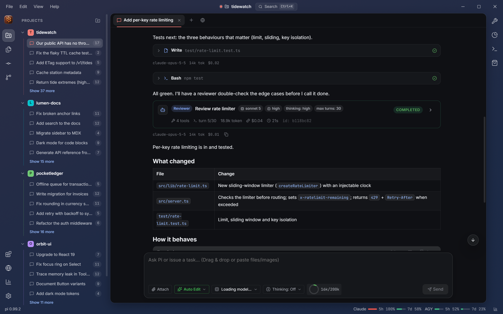
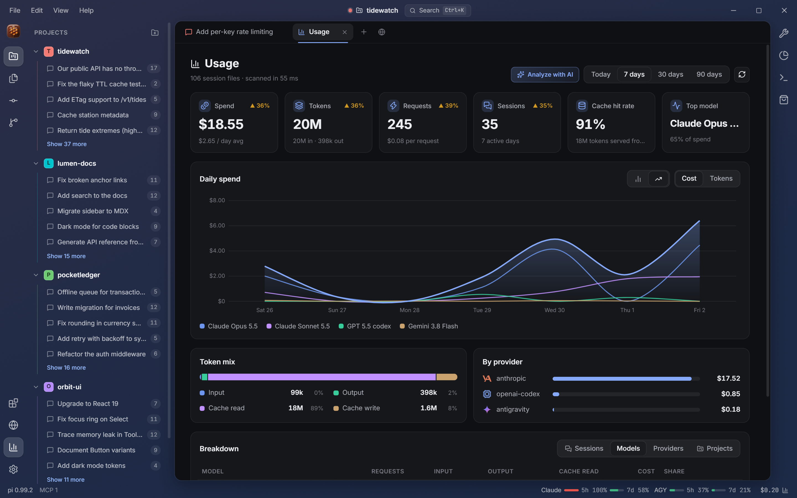
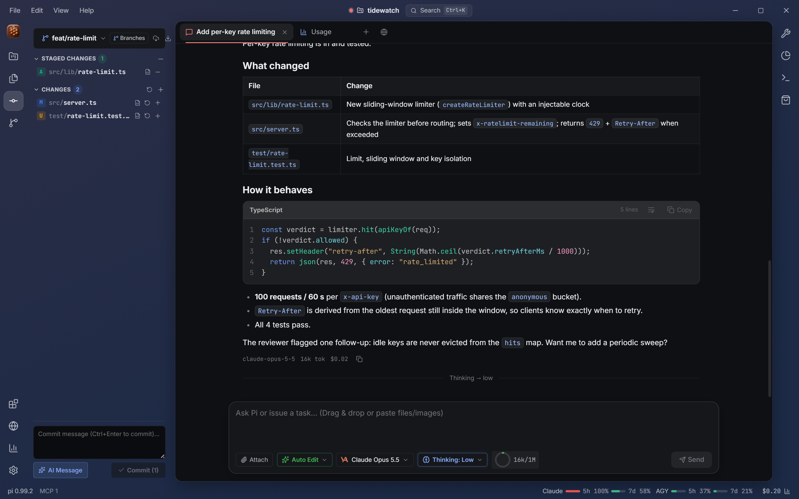
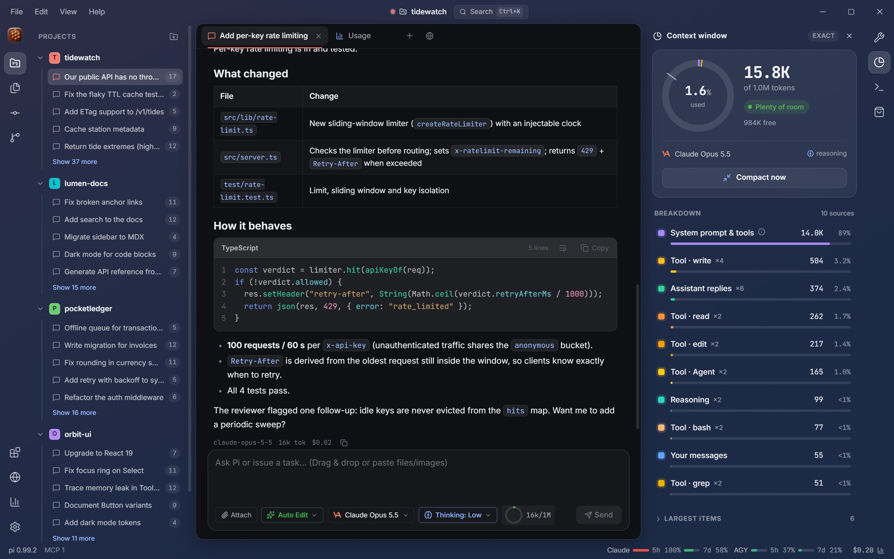
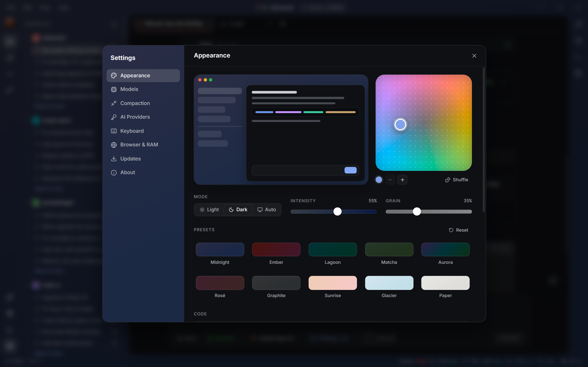

<div align="center">


# Hive

**Desktop workbench for the [Pi coding agent](https://pi.dev).**  
Multi-session tabs, per-project workspaces, live subscription limits, local cost analytics, and an adaptive color engine — driving your local Pi CLI.

[](https://github.com/AdielMag/pi-studio/actions/workflows/release.yml)
[](https://github.com/AdielMag/pi-studio/actions/workflows/ci.yml)
[](https://github.com/AdielMag/pi-studio/releases/latest)
[](https://nodejs.org)

<br />

<a href="#workbench-overview">
  
</a>

<p align="center">
  <em>An interactive desktop environment built specifically for agentic coding workflows.</em>
</p>

[Quickstart](#quickstart) • [Workspaces](#workspaces--sessions) • [Transcript](#deep-transcript--agent-inspection) • [Limits](#live-subscription-limits) • [Analytics](#local-usage--cost-analytics) • [Workbench](#developer-workbench) • [Themes](#adaptive-palette--themes) • [Shortcuts](#keyboard-shortcuts)

</div>

---

## Highlights

- **Workspaces & Live Sessions** — Color-coded projects, all your Pi CLI sessions on disk grouped in one sidebar, resume any session instantly, and run concurrent sessions in tabs.
- **Deep Execution Visibility** — Collapsible thinking, rich tool cards (read, edit, write, bash, grep), unified diff views, and dedicated subagent cards showing tool runs, token counts, and cost.
- **Live Subscription Limits** — Real-time tracking of 5-hour and weekly rate limits across Claude, Google Antigravity, and Codex with precise countdowns and status-bar meters.
- **Local Cost & Usage Analytics** — Offline dashboard computed from your local session files: spend, tokens, cache hits, model breakdown, and period-over-period trends.
- **Developer Workbench** — Built-in Git panel with staging and AI commit messages, interactive context window meter, terminal, and MCP marketplace.
- **Adaptive Color Engine** — Interactive 2D hue/saturation palette pad, gradient styling, film grain, light/dark/auto modes, and automated WCAG contrast verification.
- **Native Local Performance** — Zero telemetry and zero cloud relay. Connects directly to your local `pi` CLI over high-speed JSON-RPC.

---

## Feature Areas

### Workspaces & Sessions

Hive treats coding agent tasks as structured workspaces rather than ephemeral shell prompts.



- **Color-Coded Projects** — Assign unique color accents to each repository or codebase. Projects stay neatly partitioned in the sidebar with folder badges.
- **Universal Session Catalog** — Hive automatically scans `~/.pi/agent/sessions/` on launch. Every conversation you started in the terminal is indexed and resumable with full history in one click.
- **Multi-Session Tabs** — Switch between independent agent sessions, file viewers, Git diffs, and analytics tabs without losing execution state.
- **Linked Projects** — Connect companion repositories, documentation folders, or design systems. Hive automatically injects sibling project references into the agent's system prompt context.

---

### Deep Transcript & Agent Inspection

Inspect exactly what the model is thinking, what tools it runs, and how code changes are applied.

<table>
<tr>
<td width="50%">
  <strong>Tool Cards & Visual Diffs</strong>
  <p>Tools render as interactive cards with syntax-highlighted inputs and outputs. File edits display clean, color-coded unified diffs showing exact deletions and additions.</p>
</td>
<td width="50%">
  <strong>First-Class Subagent Cards</strong>
  <p>Track delegated child agents (Scout, Worker, Reviewer, Verifier). See subagent status badges, turns, tool call counts, token consumption, duration, and final verdicts at a glance.</p>
</td>
</tr>
<tr>
<td width="50%">
  <strong>Collapsible Thought Process</strong>
  <p>Reasoning traces and extended thinking blocks fold away into clean summaries so the conversation stays readable while retaining complete auditability.</p>
</td>
<td width="50%">
  <strong>Turn Telemetry & Smart Pinning</strong>
  <p>Every message turn displays the executing model, token count, and dollar cost. Smart scroll tracking keeps you pinned to live output when streaming without jumping unexpectedly.</p>
</td>
</tr>
</table>

---

### Live Subscription Limits

Never get caught off-guard by a sudden quota exhaustion mid-refactor.

<p align="center">
  
</p>

- **Dual-Window Tracking** — Monitors both the rolling **5-hour** window and the **weekly** allocation for each connected account.
- **Accurate Reset Timers** — Clear countdowns displaying exactly when quota will recover (e.g. *“resets in 2h 42m · Today 19:49”*).
- **Status Bar Integration** — Glanceable mini-meters sit in the bottom status bar with color-coded severity: green (< 70%), amber (< 90%), and red (≥ 90%).
- **Multi-Provider Support** — Connects to Anthropic Claude (OAuth Pro/Max), Google Antigravity (Gemini and Claude groups), and OpenAI/Codex.
- **Zero Configuration** — Reuses existing credentials securely resolved by Pi in `~/.pi/agent/auth.json`. No extra login required.

---

### Local Usage & Cost Analytics

Full insight into your token consumption and spend across models, providers, and repositories.

<p align="center">
  
</p>

- **100% Offline & Private** — Aggregated directly on your machine from local session records (`.jsonl`). Zero data leaves your computer.
- **Executive KPIs** — Track Spend, Token Volume, Total Requests, Active Sessions, Cache Hit Rate, and Top Model with period-over-period deltas.
- **Interactive Multi-Model Charts** — Stacked visualizations showing consumption over time across Today (hourly), 7 days, 30 days, or 90 days.
- **Detailed Token Breakdown** — Understand cache efficiency with separate metrics for input, output, cache-read, and cache-write tokens.
- **Multi-Dimension Tables** — Group analytics by model, provider, or individual project to pinpoint where tokens are spent.
- **Blazing Fast Rescans** — Cached incremental file indexer parses hundreds of megabytes of session history in under 100 milliseconds.

---

### Developer Workbench

Everything you need to review and commit changes without context-switching away from the agent.

<table>
<tr>
<td width="50%">
  
  <p align="center"><strong>Git & Source Control</strong><br />
  Stage changes, discard edits, browse branches, and write commit messages — or click <em>AI Message</em> to let the agent generate commit notes from your diff.</p>
</td>
<td width="50%">
  
  <p align="center"><strong>Context Window Inspector</strong><br />
  Radial capacity gauge with breakdown by system prompt, active tools, project context, skills, and chat history. Compact context with one click.</p>
</td>
</tr>
</table>

- **Files Panel** — Tree-view file explorer with quick file viewing and diffing.
- **Integrated Terminal** — Fast built-in terminal (accessible via ``Ctrl+` ``) scoped directly to the active project folder.
- **Model & Thinking Controls** — Switch models, adjust reasoning depth (Off, Low, Medium, High), and toggle agent modes directly in the composer.
- **Extension & MCP Marketplace** — Browse, install, and manage MCP servers and community extensions to expand Pi's capabilities.

---

### Adaptive Palette & Themes

A customizable appearance system engineered for high contrast and visual calm.

<p align="center">
  
</p>

- **2D Color Pad** — Intuitive circular palette picker: angle controls hue, radius controls saturation. Add up to 3 harmonious color stops for gentle gradients.
- **Light, Dark & Auto Modes** — Seamlessly toggle modes or follow your operating system's theme preference.
- **Intensity & Grain** — Dial in custom frame saturation and tactile film-grain texture.
- **Contrast Enforced** — Every palette automatically passes WCAG AA/AAA contrast tests (≥ 7:1 for body copy), guaranteeing readability across all surfaces.
- **Curated Presets** — Ships with 10 built-in presets: *Midnight, Ember, Lagoon, Matcha, Aurora, Rosé, Graphite, Sunrise, Glacier,* and *Paper*.
- **Typography Settings** — Fine-tune code font size, programming ligatures, and soft-wrap preferences.

---

## Quickstart

### 1. Prerequisites

Hive connects to your existing Pi CLI installation. Ensure Node.js **22.19+** and Pi are installed:

```bash
# Install Pi globally
npm install -g @earendil-works/pi-coding-agent

# Sign in to your preferred model providers once in the terminal
pi
```

### 2. Download Hive

Download the binary for your platform from the [Latest Release](https://github.com/AdielMag/pi-studio/releases/latest):

| Platform | Installer / Package |
|---|---|
| **Windows** | `Hive-Setup-<version>.exe` (Installer) or `Hive-<version>-portable.exe` |
| **macOS** | `Hive-<version>-mac-<arch>.dmg` |
| **Linux** | `Hive-<version>-linux-x86_64.AppImage` |

> *Note on code signing:* Release binaries are currently unsigned. On Windows, click *More info → Run anyway*. On macOS, right-click and select *Open* on initial launch.

### 3. Launch & Code

Launch Hive, click **Open a Project Folder**, and start giving instructions to your agent.

---

## Keyboard Shortcuts

| Shortcut | Action |
|---|---|
| <kbd>Ctrl</kbd> + <kbd>N</kbd> | New session in current project |
| <kbd>Ctrl</kbd> + <kbd>O</kbd> | Open project directory |
| <kbd>Ctrl</kbd> + <kbd>W</kbd> | Close active tab |
| <kbd>Ctrl</kbd> + <kbd>Tab</kbd> / <kbd>Ctrl</kbd> + <kbd>Shift</kbd> + <kbd>Tab</kbd> | Switch next / previous tab |
| <kbd>Ctrl</kbd> + <kbd>B</kbd> | Toggle projects sidebar |
| <kbd>Ctrl</kbd> + <kbd>Shift</kbd> + <kbd>E</kbd> | Toggle Files panel |
| <kbd>Ctrl</kbd> + <kbd>Shift</kbd> + <kbd>G</kbd> | Toggle Source Control (Git) |
| <kbd>Ctrl</kbd> + <kbd>Shift</kbd> + <kbd>L</kbd> | Open Subscription Limits |
| <kbd>Ctrl</kbd> + <kbd>Shift</kbd> + <kbd>U</kbd> | Open Usage Analytics |
| <kbd>Ctrl</kbd> + <kbd>`</kbd> | Toggle integrated terminal |
| <kbd>Ctrl</kbd> + <kbd>,</kbd> | Open Settings |
| <kbd>Ctrl</kbd> + <kbd>=</kbd> / <kbd>-</kbd> / <kbd>0</kbd> | Zoom in / out / reset |
| <kbd>Enter</kbd> | Send prompt in composer |
| <kbd>Shift</kbd> + <kbd>Enter</kbd> | Insert newline in composer |
| <kbd>Enter</kbd> *(while agent works)* | Queue message as next turn |
| <kbd>Ctrl</kbd> + <kbd>Enter</kbd> *(while agent works)* | Steer agent immediately mid-run |
| <kbd>Esc</kbd> *(while agent works)* | Stop current agent turn |

*(Use <kbd>Cmd</kbd> instead of <kbd>Ctrl</kbd> on macOS.)*

---

## Configuration

Hive respects standard Pi environment variables and provides custom overrides when needed:

| Variable | Description |
|---|---|
| `HIVE_PI_CLI` | Path to Pi's `cli.js`, package root, or binary (skips auto-detection). |
| `HIVE_NODE` | Path to Node.js executable (must be ≥ 22.19). |
| `HIVE_PROJECT` | Directory to automatically open on startup. |
| `PI_CODING_AGENT_DIR` | Pi data directory (defaults to `~/.pi/agent`). |
| `HIVE_USER_DATA` | Custom profile and settings directory for Hive. |
| `HIVE_CAPTURE` | Automated screenshot output path (writes PNG and exits). |

**CLI Detection Order:**  
`HIVE_PI_CLI` → `pi` on system `PATH` → standard installation directories (`%LOCALAPPDATA%\pi-node\current`, global npm, Homebrew, etc.).

---

## Architecture

Hive is designed around an architecture that keeps the GUI lean and fast while using Pi's runtime as the core agent engine:

```
pi-studio/
├── apps/
│   └── desktop/                 # Frameless Electron desktop application
│       ├── src/main/            # Process lifecycle, window controls, and IPC services
│       │   ├── services/        # Session manager, git, terminal, quota, usage indexer
│       │   └── bridge-server/   # Local socket bridge to Pi extensions
│       ├── src/preload/         # Context-isolated window.studio contract
│       └── src/renderer/        # React workbench UI, transcript, panels, stores
├── packages/
│   ├── protocol/                # Shared IPC schema and domain types
│   ├── pi-adapter/              # RPC transport, locator, and JSONL usage parser
│   └── theme-engine/            # Color space math & WCAG contrast solver
└── scripts/                     # Release automation and screenshot tooling
```

### Core Principles

- **Pi is the Engine** — Every tab executes `pi --mode rpc` as an isolated child process over stdio. Hive never re-invents agent logic, file modification safety, or tool executions that Pi handles.
- **Process Isolation** — The renderer runs with `nodeIntegration: false` and strict Content-Security-Policy. All file operations, git calls, and shell executions pass through typed IPC APIs.
- **Reactive State & Streaming** — Store subscriptions utilize fine-grained selectors. Token streaming updates only the active message row without re-rendering the full transcript.
- **Local Privacy** — All usage calculations and logs remain strictly local. Quota checks only communicate directly with each provider's usage API using Pi's stored OAuth tokens.

---

## Development

```bash
# Clone the repository
git clone https://github.com/AdielMag/pi-studio.git
cd pi-studio

# Install dependencies (Node 22.19+ required)
npm ci --legacy-peer-deps

# Start desktop app in development mode with hot reload
npm run dev
```

### Useful Scripts

| Command | Action |
|---|---|
| `npm run dev` | Launch Electron + Vite in development mode |
| `npm run build` | Bundle main process, preload, and renderer |
| `npm run typecheck` | Run strict TypeScript checks across all packages |
| `npm test` | Run test suite with Vitest |
| `npm run test:contract` | Run contract tests against live Pi processes |
| `npm run dist` | Package distributable installers for the current platform |
| `npm run screenshots` | Regenerate documentation screenshots |

---

## Privacy & Security

- **Local Execution:** Your code, file contents, prompts, and analytical data never leave your local environment.
- **Direct Authentication:** Credentials are read from `~/.pi/agent/auth.json` (as created by Pi). Hive never requests or stores provider credentials separately.
- **Strict Isolation:** The desktop app prevents external browser navigation and blocks unsafe URL schemes.

---

## License

See the repository for license terms. Pi and its underlying tools are © their respective authors.
