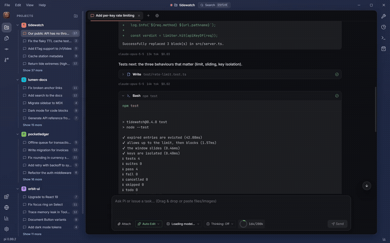

<div align="center">


# Hive

**Desktop workbench for the [Pi coding agent](https://pi.dev).**  
Multi-session tabs, live subscription limits, local cost analytics, and an adaptive theme engine — driving your local Pi CLI.

[](https://github.com/AdielMag/Hive/actions/workflows/release.yml)
[](https://github.com/AdielMag/Hive/actions/workflows/ci.yml)
[](https://github.com/AdielMag/Hive/releases/latest)



</div>

## Features

- **Workspaces & sessions** — Color-coded projects, every Pi session on disk in one sidebar, resume any of them, run several in tabs.
- **Transcript inspection** — Collapsible thinking, tool cards with diffs, subagent cards with tokens and cost.
- **Subscription limits** — 5-hour and weekly quotas for Claude, Google Antigravity, and Codex, with reset countdowns.
- **Usage analytics** — Offline spend, token, and cache dashboards built from your local session files.
- **Workbench** — Git panel with AI commit messages, context-window meter, terminal, files, MCP marketplace.
- **Themes** — 2D hue/saturation picker, light/dark/auto, WCAG-checked contrast.
- **Local only** — No telemetry, no cloud relay. Talks to your `pi` CLI over JSON-RPC.

## Quickstart

Needs Node.js **22.19+** and Pi, signed in once:

```bash
npm install -g @earendil-works/pi-coding-agent
pi
```

Download Hive from the [latest release](https://github.com/AdielMag/Hive/releases/latest) (Windows `.exe`, macOS `.dmg`, Linux `.AppImage`), then open a project folder.

> Binaries are unsigned. Windows: *More info → Run anyway*. macOS: right-click → *Open*.

Press <kbd>Ctrl</kbd>+<kbd>,</kbd> for settings (<kbd>Cmd</kbd> on macOS).

## Configuration

| Variable | Description |
|---|---|
| `HIVE_PI_CLI` | Path to Pi's `cli.js`, package root, or binary (skips auto-detection). |
| `HIVE_NODE` | Node.js executable (≥ 22.19). |
| `HIVE_PROJECT` | Folder to open on startup. |
| `PI_CODING_AGENT_DIR` | Pi data directory (default `~/.pi/agent`). |
| `HIVE_USER_DATA` | Custom Hive profile directory. |

## Development

```bash
git clone https://github.com/AdielMag/Hive.git
cd Hive
npm ci --legacy-peer-deps
npm run dev
```

Also: `npm run build`, `npm run typecheck`, `npm test`, `npm run dist`.

Layout: `apps/desktop` (Electron app), `packages/*` (protocol, pi-adapter, theme-engine), `modules/*`, `scripts/`.

## Privacy

Code, prompts, and usage data stay on your machine. Credentials are read from Pi's `~/.pi/agent/auth.json`; Hive never stores its own.

## License

See the repository for license terms. Pi and its tools are © their respective authors.
