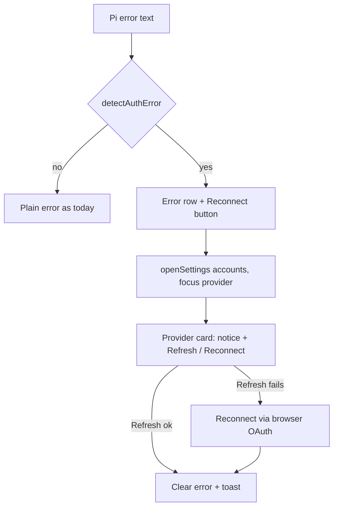

<!-- SUMMARY -->
# Auth Reconnect Flow (Executive Summary)

> [!NOTE]
> **Executive Summary**: When a Claude (`anthropic`) or Antigravity (`antigravity`) subscription token expires or fails to refresh, the session error is recognised and shows a **Reconnect** action that opens *Settings → AI Providers* focused on that provider. Settings gains a **Refresh / Reconnect** control on every OAuth account. Small change, ~8 files, no new dependencies.

## Strategy
- **Detect**: a pure helper `detectAuthError(message, fallbackProvider)` classifies Pi's auth failures (`Authentication failed for "x"… /login x`, `No API key found for x`, 401 / `invalid_grant` / `token expired` / `refresh failed`).
- **Surface**: both error surfaces (top `SessionErrorBanner` and the in-transcript `msg-error`) render an `AuthErrorActions` row: **Reconnect** (opens Settings → AI Providers, provider highlighted with an explanatory notice) + dismiss.
- **Fix**: Settings account card gets **Refresh token** (silent attempt via the Pi SDK `getAuth`, which refreshes the token) and **Reconnect** (full browser OAuth). Expired-looking tokens show a "Needs attention" chip instead of a plain "Connected".
- **Recover**: after a successful reconnect the stale error is cleared and a toast says "Reconnected — send your message again".

## Key Decisions

> [!CHOICE] Banner button behaviour
> **Question**: What should the error's primary button do?
> - (x) **Open Settings (AI Providers, provider highlighted)** [Recommended] — matches your request, no surprise browser popups
> - ( ) **Start OAuth immediately in place** — fewer clicks but opens a browser unannounced

## Milestones
- [ ] 1. Error classifier + unit tests
- [ ] 2. Main: `refreshOAuth` + status in `getAccounts`, IPC + preload
- [ ] 3. Settings: focus/notice, Refresh + Reconnect buttons, status chip
- [ ] 4. Banner and transcript error actions
- [ ] 5. Typecheck + tests
<!-- /SUMMARY -->

<!-- FULL -->
# Auth Reconnect Flow (Full Specification)

## 1. Background
- Tokens live in `~/.pi/agent/auth.json` (`apps/desktop/src/main/services/auth.ts`). Pi refreshes OAuth tokens itself; when that fails Pi throws `Authentication failed for "<provider>". Credentials may have expired or network is unavailable. Run '/login <provider>' to re-authenticate.` (`pi-coding-agent/dist/core/agent-session.js:224`), or `No API key found for <provider>` when nothing is stored.
- Provider 401s arrive as assistant `errorMessage` (rendered at `Transcript.tsx` `.msg-error`), retry failures (`auto_retry_end`), or the store-level `error` string (`SessionErrorBanner`, mounted in `WorkbenchLayout.tsx:194`).
- Settings already has an `accounts` tab with `loginOAuth`, and `useUi.openSettings(tab)` exists; neither is wired to errors, and a connected-but-broken account only ever shows "Connected".

## 2. Flow

## 3. Changes

| File | Change |
|---|---|
| `apps/desktop/src/renderer/lib/auth-errors.ts` (new) + `.test.ts` | `detectAuthError(message, fallbackProvider?)` → `{ providerId, kind: "expired" \| "missing" \| "refresh_failed" } \| null`; provider name from quoted id / keywords (`anthropic`, `claude`, `antigravity`, `google`), else fallback = active model's provider. Only `anthropic`/`antigravity`/`openai` considered. |
| `packages/protocol/src/ipc.ts` | `authRefresh: "auth:refresh"`; `refreshOAuth(providerId)` on the `studio` API type. |
| `apps/desktop/src/main/services/auth.ts` | `refreshOAuth(providerId)`: load SDK services, `modelRuntime.getAuth(providerId)`; ok → `{success:true}`, throw/undefined → `{success:false, error}`. `getAccounts()` adds `expiresAt` (ms) and `needsAttention` (OAuth entry with expired `expires`). |
| `apps/desktop/src/main/ipc/accounts.ts`, `preload/index.ts` | Register/forward `auth:refresh`. |
| `apps/desktop/src/renderer/store/ui-store.ts` | `settingsFocus: { providerId, reason } \| null`; `openSettings(tab, focus?)`; cleared on close. |
| `apps/desktop/src/renderer/components/SettingsModal.tsx` | `AccountsTab`: highlighted card + notice when focused, **Refresh token** + **Reconnect** for connected OAuth accounts, "Needs attention" chip, clear store error on success. |
| `apps/desktop/src/renderer/components/AuthErrorActions.tsx` (new) | Shared button row used by both error surfaces. |
| `SessionErrorBanner.tsx`, `Transcript.tsx` (`.msg-error`) | Render `AuthErrorActions` when `detectAuthError` matches. Note: both files have uncommitted local edits — changes are surgical. |

## 4. Edge cases
- Network offline gives the same text as expired creds → the notice says "expired *or unreachable*"; Refresh reports the real error.
- `needsAttention` is only a hint (access tokens expire hourly and normally auto-refresh), so it is only set when expiry is long past (> 24 h) to avoid false alarms.
- Running Pi processes read credentials from the shared `auth.json`; after Reconnect the user simply resends. No process restart.

## 5. Verification
- Vitest for `detectAuthError` (positive and negative: ordinary 500s, rate limits, unrelated "login" text).
- `pnpm -r typecheck` and the desktop vitest suite.
- Manual: corrupt `refresh` in a throwaway `auth.json` copy → error shows Reconnect → Settings opens focused → Reconnect succeeds.
<!-- /FULL -->
