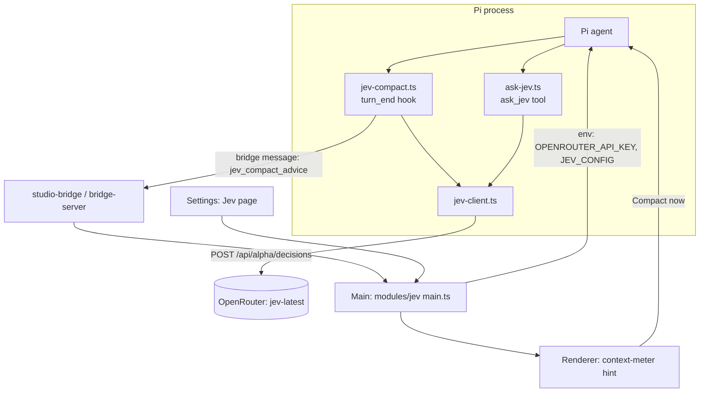

<!-- SUMMARY -->
# Jev Support: Smart Compaction, ask_jev, Model Router (Executive Summary)

> [!NOTE]
> **Executive Summary**: Add a `jev` Hive module. It does two things. First, it adds a small Jev client (OpenRouter `~typesafe/jev-latest`, alpha endpoint) and a settings page for the key. Second, it ships Pi extensions and UI for three features: smart compaction, an `ask_jev` tool, and a prompt model router. Version 1 is smart compaction (advise-only) plus `ask_jev`. The router comes in version 2.

## High-Level Strategy
- **One module, `modules/jev/`**, off by default (bonus tier). It follows the `bash-guard` pattern: a manifest, `agent/extensions/*.ts` that Pi loads, `src/main.ts`, `src/renderer.tsx`.
- **One shared client** (`jev-client.ts`) for typed `noul`, `choice` and `score` calls. It adds timeouts, fail-open behavior, and cost logging.
- **Smart compaction replaces the blind 90% rule.** Jev judges "is this a natural boundary?". Code combines that with token usage and prompt-cache age (Hive already tracks this in `cache-switch.ts`).
- **Hive shows the decision in its own UI**, as a "Good time to compact" hint on the context meter. It does not quietly prompt the model.
- **Fail open everywhere.** If there is no key, no network, or the alpha API changes, Pi behaves exactly as it does today.

## Key Decisions

> [!CHOICE] D1: Where does the Jev key come from?
> **Question**: How should Hive get the OpenRouter key?
> - (x) **Option A**: Pi `auth.json` `openrouter` api_key entry, shown in Settings → Accounts. Reuses the existing credential store. [Recommended]
> - ( ) **Option B**: `OPENROUTER_API_KEY` env var only
> - ( ) **Option C**: Separate key field stored in the Jev module settings

> [!CHOICE] D2: Compaction behavior
> **Question**: Should Jev only advise, or trigger compaction itself?
> - (x) **Option A**: Advise-only in v1 (UI hint plus an optional one-click "Compact now"). Opt-in auto-trigger in a later setting. [Recommended]
> - ( ) **Option B**: Auto-trigger from day one above a usage floor

> [!CHOICE] D3: What does "ask Jev before the LLM" mean?
> **Question**: Which should we build first?
> - (x) **Option A**: `ask_jev` agent tool in v1, then the model router in v2 (the router interacts with the prompt cache) [Recommended]
> - ( ) **Option B**: Router first
> - ( ) **Option C**: Both in v1

> [!QUESTION] Q1: Privacy
> **Question**: Jev sees conversation text (last turn plus summaries) through OpenRouter. Is that acceptable by default, or should Hive show a one-time consent notice when the module is enabled?

## Execution Milestones
- [x] 1. Module skeleton, Jev client, key handling and Settings page, with tests using a mocked endpoint
- [x] 2. `jev-compact.ts` Pi extension, with thresholds taken from Hive's compaction settings
- [x] 3. Renderer: context-meter hint, "Compact now" action, decision log
- [x] 4. `ask_jev.ts` tool, with cost tracking
- [ ] 5. (v2) Model router in the composer, cache-aware — deferred to v2 as agreed
- [x] 6. Verification, docs, CHANGELOG
<!-- /SUMMARY -->

<!-- FULL -->
# Jev Support (Full Specification)

## 1. Objective & Background

Jev is a typed decision model, not a chat model. A request carries a `state` (text or JSON) and typed questions. The reply carries typed answers with probabilities in about 300 ms for a fraction of a cent.

| Type | Returns |
|---|---|
| `noul` | Probability of yes. The caller picks the threshold. |
| `choice` | One of up to 255 caller-defined options. It cannot invent one. |
| `score` | A position on 2–10 described levels, plus confidence. |

Endpoint: `POST https://openrouter.ai/api/alpha/decisions`, model `~typesafe/jev-latest`, `Authorization: Bearer <OPENROUTER_API_KEY>`.

> [!WARNING]
> The endpoint is **alpha**. The exact request and response schema must be confirmed against the Jev repo (`apps/ten-levels/extensions/`) and a live call before coding. Isolate it behind one file (`jev-client.ts`) so a schema change touches one place.

**Problem today.** Hive compacts at a fixed percentage of the context window (`CompactionSettingsContent.tsx`, written to Pi `compaction.modelOverrides` by `services/models.ts`). That often fires mid-task. There is no smart pre-LLM routing.

## 2. Architecture & Component Flow



## 3. Decisions & Trade-Offs

> [!CHOICE] D4: Packaging
> **Question**: Where should the Pi extensions live?
> - (x) **Option A**: Separate `modules/jev` module with its own extensions, loaded through the module manifest `agent.extensions`. It can be switched off and keeps `studio-bridge.ts` small. [Recommended]
> - ( ) **Option B**: Inside `studio-bridge.ts`

> [!CHOICE] D5: How does the compaction advice reach the UI?
> **Question**: What carries the decision from the Pi extension to Hive?
> - (x) **Option A**: A new bridge message type `jev_advice` in `packages/protocol/src/bridge.ts`. The extension sends it through the existing bridge socket. [Recommended]
> - ( ) **Option B**: Pi `ctx.ui.setStatus` or widget text only. This needs no protocol change, but the UI is poor.

> [!NOTE]
> Open question to confirm in code: can a module-shipped Pi extension reach the bridge socket? If not, the bridge exposes a small `sendToGui` helper through the shared env (`bridge.env`).

## 4. Feature Design

### 4.1 Jev client (`modules/jev/agent/lib/jev-client.ts`)
- `decide({ state, questions, timeoutMs = 4000 })` returns typed answers or `null` on failure (fail open).
- Reads `OPENROUTER_API_KEY` from env. Hive sets it when spawning Pi, from the `auth.json` entry (D1).
- Records `{ts, feature, latencyMs, cost?}` into a bounded in-memory ring and into the Hive analytics log.
- Circuit breaker: 3 consecutive failures disable calls for 5 minutes.

### 4.2 Smart compaction (`jev-compact.ts`)
After each `turn_end` it makes one call with four questions:

| Question | Type | Meaning |
|---|---|---|
| `switched_gears` | noul | The user started a new task |
| `at_boundary` | noul | The last turn finished a unit of work |
| `needs_history` | score (3 levels) | How much earlier context the next step needs |
| `mid_operation` | noul | A multi-step edit is half done |

Decision in code (not in Jev), producing a tier of `silent | notice | recommend | request`:

```text
usage = contextTokens / contextWindow            // from Hive compaction settings, not demo constants
floor = max(settings.jevFloorPct (default 40%), 0)
if usage < floor                                  -> silent
if mid_operation > 0.5                            -> silent
boundary = switched_gears>0.7 || at_boundary>0.7
cacheCold = promptCacheExpired (cache-switch.ts)  // compaction is nearly free
needs_low = needs_history is low
score = usage + (boundary?0.15:0) + (cacheCold?0.10:0) + (needs_low?0.10:0)
score>=0.85 request | >=0.65 recommend | >=0.50 notice | else silent
```

- v1 only emits advice (D2). The renderer shows it. "Compact now" calls the existing Pi compact RPC.
- Hive's existing hard compaction threshold stays as the safety net.
- Optional: ask Jev (`choice`) which recent turn the current task starts from, and pass it as a custom instruction for the summary (keep that part in detail). Behind a flag, v1.1.

### 4.3 `ask_jev` tool (`ask-jev.ts`)
- The agent supplies questions plus optional file paths or a read-only command. The code reads the files or runs the command (read-only allowlist, size cap), so the contents never enter the agent context.
- Returns typed answers only. Logs each call and its cost.
- The tool description tells the model when to use it: classification, routing and yes/no checks over big inputs.

### 4.4 Model router (v2)
- Before send, `choice` picks `fast | powerful` and `score` picks reasoning effort.
- UI: a suggestion chip in the composer ("simple prompt, use Flash?"). It never switches silently.
- It must read `lib/models/cache-switch.ts`. If the cache is warm, show the cost of losing it, and only suggest a switch when it nets out positive.

### 4.5 Settings page (Jev module)
Key status (connected, test call), enable toggles per feature, compaction floor %, per-day call budget, and a "what Jev saw" log. Include a privacy notice (Q1).

## 5. Step-by-Step Implementation
1. **Recon.** Confirm the live API schema with one curl call, and check module extension loading and bridge reachability from a module extension.
2. **Skeleton.** `modules/jev/package.json` (`tier: bonus`, `recommended: false`), `src/shared.ts`, `src/main.ts`, `src/renderer.tsx`.
3. **Client and key.** Add `openrouter` to the provider list in `services/auth.ts`. Pass the key into the Pi env when the module is on.
4. **Compaction extension and protocol message.**
5. **Renderer hint and action.**
6. **`ask_jev`.**
7. **Router (v2).**

## 6. File Changes Breakdown

| File | Action | Description |
|---|---|---|
| `modules/jev/package.json` | `[NEW]` | Manifest, `agent.extensions` list |
| `modules/jev/agent/lib/jev-client.ts` | `[NEW]` | Typed OpenRouter client |
| `modules/jev/agent/extensions/jev-compact.ts` | `[NEW]` | Boundary detection, tiering, advice |
| `modules/jev/agent/extensions/ask-jev.ts` | `[NEW]` | `ask_jev` tool |
| `modules/jev/src/main.ts`, `shared.ts` | `[NEW]` | Key and env wiring, settings IPC |
| `modules/jev/src/renderer.tsx` + `ui/*` | `[NEW]` | Settings page, context-meter hint, log |
| `modules/jev/src/tiering.ts` + `.test.ts` | `[NEW]` | Pure decision logic, unit tests |
| `packages/protocol/src/bridge.ts` | `[MODIFY]` | Add `jev_advice` message |
| `apps/desktop/src/main/services/auth.ts` | `[MODIFY]` | Add `openrouter` account |
| `apps/desktop/src/renderer/components/` context meter | `[MODIFY]` | Slot for the module hint |
| `CHANGELOG.md`, `docs/` | `[MODIFY]` | Document the feature |

## 7. Verification & Test Plan
- Unit: `tiering.ts` (table-driven), `jev-client.ts` (mock fetch: success, timeout, 4xx, malformed, breaker).
- Contract: the bridge message round-trips.
- Manual: with no key, the module is inert and Pi is unchanged. With a key, finish a task and see the hint. Mid-edit shows no hint. Click "Compact now".
- `ask_jev`: confirm file contents never appear in the transcript.
- Run `pnpm test` and the typecheck for `apps/desktop`.

## 8. Risks

> [!WARNING]
> - **Alpha API** may change or vanish. Mitigations: one client file, fail open, feature flag.
> - **Latency and cost** on every turn. Mitigations: one call per turn, a daily call budget, skip when usage is below the floor.
> - **Privacy**: conversation text goes to OpenRouter. Mitigation: consent notice, opt-in module.
<!-- /FULL -->
