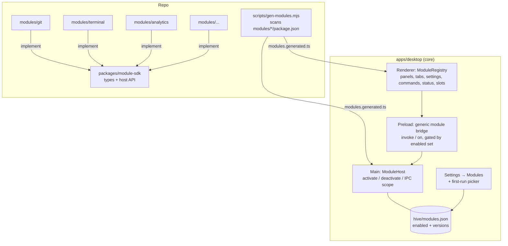

<!-- SUMMARY -->
# Lean Core + Installable Modules (Executive Summary)

> [!NOTE]
> **Executive Summary**: Turn Hive into a small **core** (sessions, transcript, composer, projects, settings) plus **modules** (Git, Terminal, Analytics, Browser, …) that each live in their own folder in this repo, plug into the shell through one generic contribution API, and can be installed/removed from a **Modules** screen. A disabled module costs nothing: it isn't loaded, has no UI, registers no IPC and starts no services.

## High-Level Strategy
- **One contract for everything**: every feature is a `HiveModule` (`modules/<id>/`) that declares a manifest and contributes panels, tabs, settings pages, commands, status-bar items and main-process IPC/services. The core never imports a module by name. A build-time codegen step finds every module folder.
- **Two ways to deliver modules, one API**:
  - **Phase 1, Bundled**: module code ships inside the app as separate lazy chunks. "Install" just enables it, instantly and offline.
  - **Phase 2, Downloadable** (optional): the same modules are built as signed zip packs attached to each GitHub release. Hive downloads them on demand, and a slim installer can leave them out.
- **Simple install UX**: a first-run "Choose your setup" picker (Minimal / Recommended / Everything), a **Settings → Modules** page with toggles, a command-palette entry, and a prompt like "Terminal isn't installed. Install?" when you use a shortcut that belongs to a missing module.

> [!IMPORTANT]
> Existing users keep everything they have. On upgrade, every module is auto-enabled. Only new installs see the picker.

> [!IMPORTANT]
> **Agent assets live with their feature (decision from Q1).** If a module needs Pi skills, AGENTS.md instructions or a CLI, it ships them in its own folder (`modules/<id>/agent/`). Enabling the module installs them into `~/.pi/agent/` (marked as Hive-managed). Disabling removes exactly what it installed. Example: `modules/plan-previewer/agent/skills/{plan-previewer,rich-plan-formatting}/SKILL.md` + its AGENTS.md managed block + the `plan-previewer` CLI shim.

## Proposed Tiers

| Tier | Modules |
|---|---|
| **Core** (always on) | Sessions & transcript, composer, model/thinking/mode pickers, projects & session catalog, accounts/auth, settings shell, command palette, question forms & extension dialogs, image attachments, compaction, updater, basic light/dark theme, context ring |
| **Recommended** (on by default) | **Git** (staging, commit, AI message), **Files** (tree + file viewer), **Diff viewer**, **Terminal**, **Live limits** (status-bar quota meters) |
| **Bonus** (opt-in) | Branches & History, Usage & Cost Analytics (+ AI Insights), Skills & Agents Library, Marketplace (MCP / Pi packages), Built-in Browser, Tools inspector, Context Breakdown panel, Plan Previewer, Arc Theme Studio (palette pad, grain, gradients) |

## Key Decisions

> [!CHOICE] D1: Delivery model
> **Question**: How "downloadable" do modules need to be?
> - (x) **Option A**: Phase 1 bundled-but-dormant now, built so Phase 2 downloadable packs can be added later [Recommended]
> - ( ) **Option B**: Bundled only. Install = enable, never download
> - ( ) **Option C**: Downloadable packs from day one (bigger effort: custom protocol, CSP change, integrity checks, shared-dependency runtime)

> [!WARNING]
> Electron itself is about 80–100 MB, while all feature JavaScript together is a few MB (Shiki grammars and xterm are the heaviest). Making modules downloadable barely changes installer size. The real wins are a cleaner UI, faster startup, fewer background services (e.g. the Plan Previewer HTTP server on :3456) and a smaller attack surface, and Phase 1 already gets you all of these.

> [!CHOICE] D2: Default for new installs
> **Question**: What should a brand-new user get on first launch?
> - (x) **Option A**: Show the picker, with "Recommended" pre-selected [Recommended]
> - ( ) **Option B**: Install Minimal silently. Users add modules later
> - ( ) **Option C**: Install Recommended silently, no picker

> [!QUESTION] Q1: Tier placement
> **Question**: Do you agree with the tier table? In particular: should **Plan Previewer** be Recommended (you rely on it heavily) or Bonus (most Pi users don't have the skill installed)? Should **Live limits** stay Recommended?

## Execution Milestones
- [ ] 0. Do the refactor on a `feat/modules` branch in an isolated worktree. The in-progress uncommitted work in the main checkout stays untouched and gets merged later
- [ ] 1. Module SDK + module host (main & renderer) + registries + Modules settings page, with zero features extracted yet
- [ ] 2. Extract the isolated modules: Plan Previewer, Browser, Marketplace, Library
- [ ] 3. Extract Analytics/Limits, Terminal, Tools, Context Breakdown, Theme Studio
- [ ] 4. Extract Git + Branches + Files + Diff viewer (most coupled), then onboarding picker + upgrade migration
- [ ] 5. (Phase 2, optional) Downloadable module packs + slim installer
<!-- /SUMMARY -->

<!-- FULL -->
# Lean Core + Installable Modules (Full Specification)

## 1. Objective & Current State

**Goal:** a lean default Hive where every non-essential feature is a self-contained, removable module in the same monorepo, with one generic way to add a feature and one simple way for users to install it.

**What the recon found (today's coupling):**

| Choke point | Where | Problem |
|---|---|---|
| Panel unions | `renderer/store/layout-persist.ts:1-2` (`LeftPanel`, `RightPanel`, `VALID_LEFT_PANELS`) | Fixed string unions, so a new panel requires editing core |
| Tab switch | `renderer/components/WorkbenchLayout.tsx` (`activeTab?.kind === "usage" ? … : "library" ? …`) | Hard-coded ternary chain |
| Rail buttons | `WorkbenchLayout.tsx` (rail `active={ui.left === "git"}` …) | Hard-coded |
| Lazy imports | `WorkbenchLayout.tsx:43-55` | Already code-split per feature ✅. These lines are a natural seam for the move to a registry |
| Settings tabs | `SettingsModal.tsx:24-33,71-78` | Fixed `TABS` array + switch |
| Title-bar menu | `AppTitleBar.tsx:83-143` | Hard-coded View items |
| Status bar | `StatusBar.tsx:8-9,57,118` | Imports `features/insights` directly |
| Commands | `features/commands/registry.ts:40-156` | Data-driven ✅, but a static list |
| Session store | `store/session-store.ts:27-28` | Imports `useBrowserStore` and `useInsights` directly |
| Main context | `main/context.ts` (`AppContext` has `marketplace`, `quota`, `usage`, `terminals`, `planPreviewer`, …) | Every service is constructed at boot |
| IPC | `main/ipc/index.ts` (`registerIpc` calls 7 registrars) | Modular per domain ✅, but not driven by a list |
| Preload | `preload/index.ts` (386 lines of named methods) | Every feature's API is hard-wired into `window.studio` |
| Eager service | `services/plan-previewer.ts:49` | HTTP server on :3456 starts at every launch |
| Protocol | `@hive/protocol` `TabItem.kind` | Closed union |

The main process is already well factored (one `AppContext` plus per-domain `register*Ipc`), and the renderer already lazy-loads heavy views. Most of the work is replacing **hard-coded lists with registries**.

## 2. Architecture



### 2.1 Module shape (generic: every feature follows the same layout)

```
modules/git/
  package.json        # name "@hive-module/git" + "hive" manifest block
  src/shared.ts       # channel names + payload types (imported by main & renderer)
  src/main.ts         # export default defineMainModule({ activate(ctx) { … } })
  src/renderer.tsx    # export default defineRendererModule({ contributes: { … } })
  src/*.test.ts
```

```jsonc
// modules/git/package.json → "hive" block
{
  "id": "git",
  "title": "Git",
  "description": "Staging, commits, AI commit messages, push/pull.",
  "tier": "recommended",            // core | recommended | bonus
  "requires": ["diff-viewer"],      // auto-enabled together
  "optionalDeps": ["feature-models"],
  "icon": "git-branch",
  "category": "Workbench",
  "agent": {                          // optional agent assets, installed on enable / removed on disable
    "skills": ["agent/skills/*"],     // copied to ~/.pi/agent/skills/<name>/ (+ .hive-managed marker)
    "agentsMd": "agent/AGENTS.block.md", // inserted as <!-- BEGIN <id> managed block --> in ~/.pi/agent/AGENTS.md
    "bin": { "plan-previewer": "bin/plan-previewer.js" } // CLI shim placed in a Hive-managed bin dir on PATH
  }
}
```

### 2.1b Agent assets: generic installer (core)
`main/modules/agent-assets.ts` is one generic installer driven by the manifest `agent` block:
- **Enable** → copy skills, upsert the AGENTS.md managed block, write the CLI shims, and record each written path in `modules.json` (`installedAssets[id]`).
- **Disable** → remove only the recorded paths and the managed block. Skills the user edited (hash mismatch) are kept, with a notice.
- **App update** → re-sync assets for enabled modules, so skills always match the module version.
- No feature-specific code: a new module gets skills support just by adding the folder.

### 2.2 Contribution API (renderer)

```ts
defineRendererModule({
  id: "git",
  contributes: {
    leftPanels:   [{ id: "git", title: "Source Control", icon: GitBranch, component: lazy(() => import("./GitPanel")) }],
    rightPanels:  [],
    tabKinds:     [{ kind: "git.diff", title: (t) => t.path, component: lazy(() => import("./DiffTab")) }],
    settings:     [{ id: "git", title: "Git", component: lazy(() => import("./GitSettings")) }],
    commands:     [{ id: "git.focus", title: "Show Source Control", defaultKeys: "Ctrl+Shift+G", run: (h) => h.panels.open("left", "git") }],
    statusBar:    [],
    titleMenu:    [{ menu: "view", label: "Source Control", command: "git.focus" }],
    slots:        { "file-viewer.actions": [AskPiButton] },   // named extension points
    aiFeatures:   [{ id: "git.commitMessage", label: "Commit message generation" }],
  },
  onSessionEvent(evt, host) { /* replaces direct store imports */ },
});
```

The host passes a `ModuleHost` object (tabs, panels, toast, ai, sessions, theme, ipc). Modules only touch core through it, never through `renderer/store/*` internals.

### 2.3 Main-process API

```ts
defineMainModule({
  id: "plan-previewer",
  activate(ctx) {                       // called only when enabled
    const svc = new PlanPreviewerService(ctx.paths);
    svc.start();                        // the :3456 server now only runs if the module is on
    ctx.ipc.handle("getPlanData", (p) => svc.get(p));   // auto-namespaced → "mod:plan-previewer:getPlanData"
    ctx.ipc.emitter("planUpdated");
    return () => svc.stop();            // deactivate / dispose
  },
});
```

`ctx` is a scoped view of today's `AppContext` (window, guiStore, pi location, sessions, a logger, and `paths.moduleData(id)`).

### 2.4 Preload becomes generic
Core keeps its typed `window.studio.*` methods. Modules use **one** generic bridge:
`window.studio.modules.invoke(moduleId, method, ...args)` / `.on(moduleId, event, cb)`. Main rejects calls to modules that are disabled. Each module wraps this in typed helpers from its own `shared.ts`, so the preload never changes when modules are added.

### 2.5 Persistence & lifecycle
- `<userData>/hive/modules.json` → `{ "schema": 1, "enabled": ["git","terminal",…], "onboarded": true }`
- Enable/disable is live where possible: main `activate`/`dispose`, renderer registry updates through a zustand store. Fallback is a "Restart to apply" banner.
- `requires` is resolved transitively. You can't disable a module that another enabled module requires without disabling that one too (the UI explains why).
- Persisted tabs/panels from a disabled module render a placeholder: "This tab needs **Usage Analytics**. [Install]".

## 3. Install / Download UX (the "simple way")

1. **First-run picker**: three preset cards (Minimal · Recommended · Everything) plus an expandable checklist. You can change it any time.
2. **Settings → Modules** (a core tab): cards grouped by tier, each with a description, what it adds (e.g. "adds a panel and 3 commands"), a toggle, dependency notes, and, in Phase 2, size and download progress.
3. **Command palette**: `Modules: Install…`, `Modules: Manage`.
4. **Just-in-time prompts**: if a disabled module owns a shortcut or command (e.g. `Ctrl+\`` for Terminal), core shows a toast: "Terminal isn't installed. Install". This works because the codegen'd manifest index (metadata only) is always available, even for disabled modules.
5. **(Phase 2) CLI**: `hive modules add terminal git` / `hive modules list`, via the existing `apps/desktop/bin` entry.

## 4. Decisions & Trade-Offs

> [!CHOICE] D1: Delivery model
> **Question**: How "downloadable" do modules need to be?
> - (x) **Option A**: Phase 1 bundled-but-dormant now, built so Phase 2 downloadable packs can be added later [Recommended]
> - ( ) **Option B**: Bundled only. Install = enable, never download
> - ( ) **Option C**: Downloadable packs from day one

**Phase 2 design (if/when wanted):**
- Each module is built as a standalone bundle (`main.mjs` + `renderer.js` + css) and published as `hive-module-<id>-<appVersion>.zip` on the **same GitHub release**, alongside a `modules-index.json` (id, version, sha256, size).
- **Version-locked to the app version** (same repo, same release). There is no compatibility matrix. On app update, installed modules re-download.
- Downloads go to `<userData>/hive/modules/<id>/<ver>/`. The sha256 is checked against the index fetched over HTTPS.
- Main loads with `import(pathToFileURL(main.mjs))`. The renderer loads through a new privileged `hive-module://` protocol (`protocol.handle`), and the CSP adds `hive-module:` to `script-src`. Today the CSP is `script-src 'self'` (`renderer/index.html:6-9`), with no custom protocol.
- Shared deps (react, react-dom, zustand, lucide-react, module-sdk) are externalized and supplied by the host as a shared runtime, so modules don't duplicate React.
- A "slim" electron-builder flavor leaves bonus modules out. The full installer stays the default.

> [!CHOICE] D2: Default for new installs
> **Question**: What should a brand-new user get on first launch?
> - (x) **Option A**: Show the picker, with "Recommended" pre-selected [Recommended]
> - ( ) **Option B**: Install Minimal silently
> - ( ) **Option C**: Install Recommended silently, no picker

> [!QUESTION] Q1: Tier placement
> **Question**: Agree with the tiers? Specifically Plan Previewer (Recommended vs Bonus) and Live limits (Recommended vs Bonus)?

> [!QUESTION] Q2: Third-party modules
> **Question**: Should the SDK be treated as a public API for outside authors later (needs a stability promise and a sandboxing story), or stay internal, first-party only, for now? The plan assumes **internal-only**.

## 5. Module Catalog & Dependencies

| Module id | Tier | Moves from | Requires | Contributes |
|---|---|---|---|---|
| `diff-viewer` | recommended | `components/DiffViewerTab.tsx`, `FileViewerTab.tsx` | – | tab kinds `diff`, `file` |
| `files` | recommended | `components/FilesPanel.tsx`, `services/files.ts` (list/run parts) | `diff-viewer` | left panel, command |
| `git` | recommended | `components/GitPanel.tsx`, `services/git.ts`, git IPC in `ipc/workspace.ts` | `diff-viewer` | left panel, AI feature, commands, title menu |
| `branches` | bonus | `components/BranchesPanel.tsx` | `git` | left panel |
| `terminal` | recommended | `components/TerminalPanel.tsx`, `services/terminal.ts`, xterm deps | – | right panel, shortcut |
| `limits` | recommended | `services/quota/*`, quota parts of `features/insights` + `StatusBar.tsx` popovers | – | status-bar item |
| `analytics` | bonus | `features/insights/*`, `services/usage.ts`, `usage-ai.ts` | `limits` (optional) | tab kind `usage`, AI feature |
| `library` | bonus | `features/library/*`, `services/library.ts`, `ipc/library.ts` | – | tab kind, command |
| `marketplace` | bonus | `MarketplacePanel.tsx`, `services/marketplace.ts` | – | right panel |
| `browser` | bonus | `components/browser/*`, browser store, browser settings | – | tab kind, settings page, session hook |
| `tools` | bonus | `ToolsPanel.tsx`, `services/mcp-catalog.ts` | – | right panel |
| `context-breakdown` | bonus | `ContextBreakdownPanel/View.tsx`, `services/context-files.ts` | – | right panel (the context ring stays core) |
| `plan-previewer` | recommended (TBD) | `features/plan/*`, `services/plan-previewer.ts`, `ipc/plan.ts`, `bin/plan-previewer.js` + **skills `plan-previewer`, `rich-plan-formatting` and the AGENTS.md block** (currently only installed by hand in `~/.pi/agent`) | – | tab kind, HTTP server, CLI, agent assets |
| `theme-studio` | bonus | `features/appearance/ArcThemeEditor.tsx` | – | settings page (core keeps preset light/dark/auto) |

**Stays core**: transcript (incl. tool cards and inline diffs, so Shiki stays a lazily loaded core lib), composer, `Markdown.tsx`, feature-models store + `AiModelChip` (becomes `host.ai`, and the Models settings page lists the `aiFeatures` that modules contribute), question/extension modals (the Pi extension UI protocol blocks on them), image preview, updater, accounts.

## 6. Decoupling Work (cross-feature imports to break)

| Coupling | Fix |
|---|---|
| `session-store.ts:27-28` → browser store, insights | `host.sessions.onEvent` bus. The browser and analytics modules subscribe to it |
| `StatusBar.tsx:8-9` → `features/insights` | `statusBar` contribution from `limits` |
| `GitPanel`, `UsageView`, `DiffViewerTab`, `FileViewerTab` → `feature-models-store` | `host.ai.resolveModel(featureId)` + `<host.ui.AiModelChip/>` |
| `FileViewerTab.tsx:12` → `appearance-store` | `host.theme` (core) |
| `library/SectionCard`, `plan/PlanPreviewerTab` → `components/code/Markdown` | Re-export through the SDK as `host.ui.Markdown` |
| `FilesPanel` → terminal APIs | `host.commands.run("terminal.runInTerminal", …)` with a graceful no-op or "Install Terminal" prompt |

**Guardrail:** add `scripts/check-module-boundaries.mjs` (run in CI) that fails if `apps/desktop/src/**` imports `modules/**`, or if a module imports another module's internals (only its `shared.ts` exports are allowed).

## 7. Step-by-Step Implementation

### Milestone 0: Isolate
- Another session is actively editing the main checkout (18 uncommitted files). All module work happens on branch `feat/modules` in a separate git worktree, starting from `HEAD`, and gets rebased or merged once that work lands.

### Milestone 1: Foundation (no behavior change)
1. `[NEW] packages/module-sdk`: `defineMainModule`, `defineRendererModule`, manifest types, `ModuleHost` interface, contribution types.
2. `[NEW] scripts/gen-modules.mjs`: scans `modules/*/package.json` and emits `apps/desktop/src/{main,renderer}/modules.generated.ts` (manifest index plus a lazy `import()` per module). Hook it into `dev`/`build`/`typecheck`.
3. `[MODIFY] package.json`: add `"modules/*"` to `workspaces`.
4. `[NEW] main/modules/host.ts`: reads `modules.json`, resolves `requires`, activates and disposes modules, scoped IPC (`mod:<id>:<method>`), enabled-gate.
5. `[MODIFY] preload/index.ts`: add the generic `modules.invoke/on`.
6. `[NEW] renderer/modules/registry.ts` + `useContributions(point)`: zustand-backed.
7. `[MODIFY]` `WorkbenchLayout.tsx`, `layout-persist.ts`, `SettingsModal.tsx`, `AppTitleBar.tsx`, `StatusBar.tsx`, `commands/registry.ts`, `TabStrip.tsx`: render built-ins **and** registry contributions. Panel and tab ids widen to `string` (validated against the registry).
8. `[MODIFY] @hive/protocol`: `TabItem.kind` becomes `string`.
9. `[NEW] renderer/features/modules/ModulesSettings.tsx`: the Modules page.
10. `[NEW] main/modules/agent-assets.ts`: the generic skills / AGENTS.md block / CLI-shim installer (§2.1b), with unit tests against a temp `PI_CODING_AGENT_DIR`.

### Milestone 2: Extract isolated modules (one PR each)
`plan-previewer` (also fixes the eager :3456 server), `browser`, `marketplace`, `library`.

### Milestone 3: Extract medium modules
`limits`, `analytics`, `terminal`, `tools`, `context-breakdown`, `theme-studio`.

### Milestone 4: Extract coupled modules + onboarding
`diff-viewer`, `files`, `git`, `branches`; first-run picker; upgrade migration (when `modules.json` is missing and an existing `ui-state.json` is found → enable all); just-in-time install toasts.

### Milestone 5 (optional): Downloadable packs
Per-module build targets, release-workflow upload of `hive-module-*.zip` + `modules-index.json`, the `hive-module://` protocol + CSP, the download/verify service, a slim installer flavor, and the CLI.

## 8. File Changes Overview (Milestone 1)

| File | Action | Risk |
|---|---|---|
| `packages/module-sdk/**` | `[NEW]` | `[LOW RISK]` |
| `scripts/gen-modules.mjs` | `[NEW]` | `[LOW RISK]` |
| `apps/desktop/src/main/modules/host.ts` | `[NEW]` | `[LOW RISK]` |
| `apps/desktop/src/main/index.ts`, `ipc/index.ts`, `context.ts` | `[MODIFY]` | `[LOW RISK]` |
| `apps/desktop/src/preload/index.ts` | `[MODIFY]` | `[LOW RISK]` |
| `apps/desktop/src/renderer/modules/registry.ts` | `[NEW]` | `[LOW RISK]` |
| `WorkbenchLayout.tsx`, `layout-persist.ts`, `TabStrip.tsx`, `SettingsModal.tsx`, `AppTitleBar.tsx`, `StatusBar.tsx`, `commands/registry.ts` | `[MODIFY]` | `[HIGH RISK]` (core layout) |
| `packages/protocol` (TabItem.kind) | `[MODIFY]` | `[LOW RISK]` |
| `package.json` (workspaces), `vitest.config.ts`, `tsconfig.*` | `[MODIFY]` | `[LOW RISK]` |

## 9. Verification
- **Unit**: module-host (dependency resolution, cycles, enable/disable, IPC gate rejects disabled modules), registry (contribution add/remove, persisted-panel fallback), gen-modules output snapshot.
- **Boundary check**: `node scripts/check-module-boundaries.mjs` runs in CI.
- **Lean smoke**: app boots, starts a session and chats with **zero** modules enabled. No :3456 listener, no rail buttons for missing features.
- **Per-module smoke**: each module boots with core + only its `requires`.
- **Agent assets**: enable → skill files + managed block exist; disable → removed; a user-edited skill is preserved; re-enable is idempotent.
- **Upgrade test**: start from an existing `ui-state.json` that has no `modules.json`, so everything gets enabled and the persisted layout is unchanged.
- Existing `npm test`, `npm run test:contract` and `npm run typecheck` stay green after every extraction PR.
- **Manual**: toggle each module live in Settings → Modules, and check that its panel/tab/commands appear and disappear and that the JIT install toast fires from its shortcut.
<!-- /FULL -->
