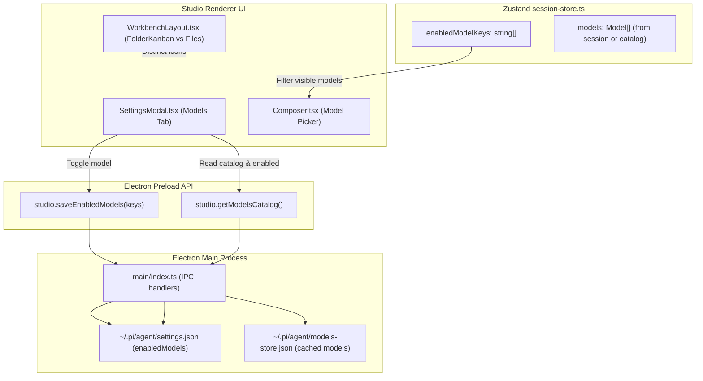

<!-- SUMMARY -->
# Implementation Plan: Settings Models Tab & Project vs File Icon Distinction (Executive Summary)

> [!NOTE]
> **Executive Summary**: We will implement two core improvements: (1) A comprehensive **Models Tab** inside Pi Studio's Settings modal that allows users to enable/disable specific models, synchronizing directly with Pi's native `~/.pi/agent/settings.json` (`enabledModels`), and filtering the Composer model dropdown accordingly with a quick shortcut to manage models; and (2) Replace the project icon (`Folder`) with `FolderKanban` across the activity bar, dock tabs, sidebar, and tab strip to clearly distinguish project workspaces from file explorer icons (`Files`).

## High-Level Strategy & Architecture
- **Icon Distinctness**: Replace the generic `Folder` icon with `FolderKanban` for all project-level UI elements (`WorkbenchLayout.tsx`, `DockShell.tsx`, `Sidebar.tsx`, `TabStrip.tsx`, and `AppTitleBar.tsx`). `FolderKanban` displays internal project workflow columns inside the folder silhouette, providing immediate visual contrast against the dual-page `Files` explorer icon.
- **Models Catalog & Persistence Backend**: In the Electron main process, implement `IPC.modelsGetCatalog` and `IPC.modelsSaveEnabled` to read/write `enabledModels` in `~/.pi/agent/settings.json` and load available models from `~/.pi/agent/models-store.json` (with active session fallback).
- **Settings Modal Tab (`SettingsModal.tsx`)**: Add a dedicated **Models** navigation tab featuring:
  - Real-time search and provider filter chips (Antigravity, Anthropic, OpenAI, ZAI, OpenRouter).
  - Model cards displaying model name, ID, context window size (1M, 200K, etc.), reasoning support, vision capabilities, and active status toggles.
  - Quick bulk actions ("Select All", "Deselect All", and provider-level toggles) with an active count badge ("X of Y models active").
- **Composer Dropdown Filtering (`Composer.tsx`)**: Filter the model dropdown list so only user-selected active models appear in the picker. Add a clean footer ("Showing X of Y active models · Manage in Settings") that opens the Settings modal directly to the Models tab.

## Key Decisions

> [!CHOICE] D1 — Persistence Format & Synchronization for Enabled Models
> **Question**: Where and how should enabled/disabled model choices be stored?
> - (x) **Option A**: Native Pi settings file `~/.pi/agent/settings.json` (`enabledModels` array of `provider/modelId`). (Directly aligns with Pi CLI's own `enabledModels` standard, persists across sessions, and keeps CLI Ctrl+P cycling in sync with Studio UI) [Recommended]
> - ( ) **Option B**: Desktop-only store `pi-studio/ui-state.json`. (Breaks synchronization with Pi CLI and ignores existing Pi configuration)

> [!CHOICE] D2 — Project Icon Replacement
> **Question**: Which icon should represent Projects to clearly differentiate from Files?
> - (x) **Option A**: `FolderKanban` from `lucide-react`. (Retains folder metaphor for project workspace directories while adding distinct vertical kanban board columns that instantly differentiate from the two-page `Files` document outline) [Recommended]
> - ( ) **Option B**: `Briefcase`. (Completely different shape, but less familiar for software code directories)

## Execution Milestones
- [x] 1. Project vs File Icon Distinction: Update `WorkbenchLayout`, `DockShell`, `Sidebar`, `TabStrip`, and `AppTitleBar` to use `FolderKanban` for Projects.
- [x] 2. Protocol & Preload Contracts: Add `models:get-catalog` and `models:save-enabled` IPC channels in `@pi-studio/protocol` and expose on `window.studio` in preload.
- [x] 3. Main Process Models Service: Implement catalog loader and `settings.json` reader/writer in `apps/desktop/src/main`.
- [x] 4. Session Store Integration: Add `enabledModelKeys`, `loadModelsCatalog`, and `saveEnabledModels` in `session-store.ts`.
- [x] 5. Settings Modal Models Tab: Build the Models management tab in `SettingsModal.tsx` with search, provider chips, capability tags, and toggles.
- [x] 6. Composer Dropdown Filtering: Update `Composer.tsx` to filter the picker by `enabledModelKeys` and add a link to open Settings.
- [x] 7. Verification: Run TypeScript typecheck, unit tests, and verify visual distinctness.
<!-- /SUMMARY -->

<!-- FULL -->
# Implementation Plan: Settings Models Tab & Project vs File Icon Distinction (Full Specification)

## 1. Objective & Current Deficiencies

1. **Icon Confusion**: In `WorkbenchLayout.tsx` and `DockShell.tsx`, the Activity Bar displays `Folder` for Projects directly next to `Files` for the File Explorer. At 18px size on dark backgrounds, both icons render as generic rectangular outlines with a minor top edge, making them visually ambiguous and confusing for users.
2. **Missing Model Selection & Filtering**: Currently, `Composer.tsx` renders all models retrieved from the session without any mechanism for users to restrict or curate which models appear in the dropdown. Users with many models or multiple providers (e.g. Anthropic, Google Antigravity, OpenAI, ZAI, OpenRouter with 300+ models) suffer from cluttered dropdown menus and cannot customize their preferred models.

## 2. Architecture & Data Flow



## 3. Decisions & Trade-Offs

> [!CHOICE] D1 — Persistence Format & Synchronization for Enabled Models
> **Question**: Where and how should enabled/disabled model choices be stored?
> - (x) **Option A**: Native Pi settings file `~/.pi/agent/settings.json` (`enabledModels` array of `provider/modelId`). (Directly aligns with Pi CLI's own `enabledModels` standard, persists across sessions, and keeps CLI Ctrl+P cycling in sync with Studio UI) [Recommended]
> - ( ) **Option B**: Desktop-only store `pi-studio/ui-state.json`. (Breaks synchronization with Pi CLI and ignores existing Pi configuration)

> [!CHOICE] D2 — Project Icon Replacement
> **Question**: Which icon should represent Projects to clearly differentiate from Files?
> - (x) **Option A**: `FolderKanban` from `lucide-react`. (Retains folder metaphor for project workspace directories while adding distinct vertical kanban board columns that instantly differentiate from the two-page `Files` document outline) [Recommended]
> - ( ) **Option B**: `Briefcase`. (Completely different shape, but less familiar for software code directories)

## 4. Step-by-Step Implementation Breakdown

### Step 1: Replace Project Icon with `FolderKanban`
- In `apps/desktop/src/renderer/components/WorkbenchLayout.tsx`:
  - Change `icon={<Folder size={18} />}` to `icon={<FolderKanban size={18} />}` for Projects.
- In `apps/desktop/src/renderer/components/DockShell.tsx`:
  - Change `id === "projects"` icon to `<FolderKanban size={18} />`.
- In `apps/desktop/src/renderer/components/Sidebar.tsx`:
  - Replace `Folder` with `FolderKanban` for the project entries so the kanban silhouette is consistent with the dock.
- In `apps/desktop/src/renderer/components/TabStrip.tsx`:
  - Replace `Folder` with `FolderKanban` for project tab badges.
- In `apps/desktop/src/renderer/components/AppTitleBar.tsx`:
  - Replace `Folder` with `FolderKanban` for the active project badge.

### Step 2: Protocol IPC Channels & Preload API
- In `packages/protocol/src/ipc.ts`:
  - Add `IPC.modelsGetCatalog = "models:get-catalog"`.
  - Add `IPC.modelsSaveEnabled = "models:save-enabled"`.
  - Add types for `ModelsCatalogResponse`:
    ```ts
    export interface ModelsCatalogResponse {
      models: Array<{
        id: string;
        name: string;
        provider: string;
        contextWindow?: number;
        reasoning?: boolean;
        input?: string[];
      }>;
      enabledModels: string[];
    }
    ```
  - Update `StudioApi` interface in `packages/protocol/src/ipc.ts`:
    ```ts
    getModelsCatalog(): Promise<ModelsCatalogResponse>;
    saveEnabledModels(enabledModels: string[]): Promise<{ success: boolean }>;
    ```
- In `apps/desktop/src/preload/index.ts`:
  - Implement `getModelsCatalog` and `saveEnabledModels`.

### Step 3: Main Process Models Catalog & Settings Handler
- In `apps/desktop/src/main/index.ts`:
  - Read `~/.pi/agent/settings.json` to get `enabledModels: string[]`.
  - Read `~/.pi/agent/models-store.json` to gather all cached models across providers (`anthropic`, `antigravity`, `openrouter`, `zai`).
  - Fallback: if `models-store.json` is missing or empty, combine known common models from installed packages or active session.
  - On `IPC.modelsSaveEnabled`: write the new `enabledModels` array atomically into `~/.pi/agent/settings.json`, preserving all other settings fields (e.g. `lastChangelogVersion`, `defaultProvider`, `packages`, `providers`, `theme`, etc.).

### Step 4: Zustand Session Store Integration
- In `apps/desktop/src/renderer/store/session-store.ts`:
  - Add state: `enabledModelKeys: string[]`.
  - Add action: `loadModelsCatalog: () => Promise<void>`.
  - Add action: `saveEnabledModels: (keys: string[]) => Promise<void>`.
  - Trigger `loadModelsCatalog()` during store initialization/bootstrap and when active session models load.

### Step 5: Settings Modal "Models" Tab
- In `apps/desktop/src/renderer/components/SettingsModal.tsx`:
  - Add `"models"` tab to `SettingsModalProps` and `activeTab` navigation.
  - Add navigation item `<NavButton icon={<Cpu size={15} />} label="Models" active={activeTab === "models"} onClick={() => setActiveTab("models")} />`.
  - Header: displays "Model Selection & Dropdown Availability".
  - Tab UI Features:
    - Search input: filters by model name, ID, or provider.
    - Provider filter pills: "All", "Google Antigravity", "Anthropic", "OpenAI", "Zai", "OpenRouter".
    - Status summary: "X of Y models enabled for selector".
    - Bulk action buttons: "Enable All", "Disable All".
    - Grouped list by provider with ProviderIcon.
    - Model item card:
      - Checkbox / switch toggle to enable/disable.
      - Model display name and ID.
      - Badges: context window tag (e.g. `1M tokens`, `200K`), `Reasoning` badge, `Vision` badge.
      - Fast responsive click handling that persists immediately.

### Step 6: Composer Dropdown Filtering
- In `apps/desktop/src/renderer/components/Composer.tsx`:
  - Filter `models` using `enabledModelKeys`:
    ```ts
    const visibleModels = models.filter((m) => {
      if (enabledModelKeys.length === 0) return true;
      const key = `${m.provider}/${m.id}`;
      return enabledModelKeys.includes(key) || enabledModelKeys.includes(m.id);
    });
    ```
  - Use `visibleModels` for dropdown options and search filtering.
  - In the dropdown popup footer:
    - Add a footer row: `Showing ${filteredModels.length} models · ` with a button/link `Manage in Settings` that calls an `openSettings("models")` callback or event.
- In `apps/desktop/src/renderer/components/WorkbenchLayout.tsx` & `App.tsx`:
  - Wire opening Settings modal directly with `initialTab="models"` when requested.

## 5. File Changes Breakdown

| File | Action | Description |
|---|---|---|
| `apps/desktop/src/renderer/components/WorkbenchLayout.tsx` | `[MODIFY]` | Replace `Folder` with `FolderKanban` for Projects; pass `openSettingsWithTab` |
| `apps/desktop/src/renderer/components/DockShell.tsx` | `[MODIFY]` | Replace `Folder` with `FolderKanban` for dock tab icon |
| `apps/desktop/src/renderer/components/Sidebar.tsx` | `[MODIFY]` | Replace `Folder` with `FolderKanban` for project list items |
| `apps/desktop/src/renderer/components/TabStrip.tsx` | `[MODIFY]` | Replace `Folder` with `FolderKanban` for project tab badge |
| `apps/desktop/src/renderer/components/AppTitleBar.tsx` | `[MODIFY]` | Replace `Folder` with `FolderKanban` for project badge |
| `packages/protocol/src/ipc.ts` | `[MODIFY]` | Add `modelsGetCatalog` & `modelsSaveEnabled` IPC channels and types |
| `apps/desktop/src/preload/index.ts` | `[MODIFY]` | Expose `getModelsCatalog` and `saveEnabledModels` in `window.studio` |
| `apps/desktop/src/main/index.ts` | `[MODIFY]` | Implement IPC handlers for reading/saving models catalog & `settings.json` |
| `apps/desktop/src/renderer/store/session-store.ts` | `[MODIFY]` | Add `enabledModelKeys`, `loadModelsCatalog`, and `saveEnabledModels` |
| `apps/desktop/src/renderer/components/SettingsModal.tsx` | `[MODIFY]` | Add Models tab with search, provider chips, model cards, toggles |
| `apps/desktop/src/renderer/components/Composer.tsx` | `[MODIFY]` | Filter dropdown by `enabledModelKeys` and add "Manage in Settings" link |

## 6. Verification & Automated Test Plan
- Run `npm run typecheck` to verify TypeScript compile across all packages and desktop app.
- Run `npm test` to verify existing vitest unit tests pass.
- Add unit tests for catalog reading and `settings.json` atomic update.
- Verify in browser preview:
  1. Activity bar shows `FolderKanban` (clearly distinct from `Files`).
  2. Settings modal has "Models" tab displaying available models with checkboxes.
  3. Toggling models updates `enabledModels` and filters the Composer dropdown immediately.
<!-- /FULL -->
