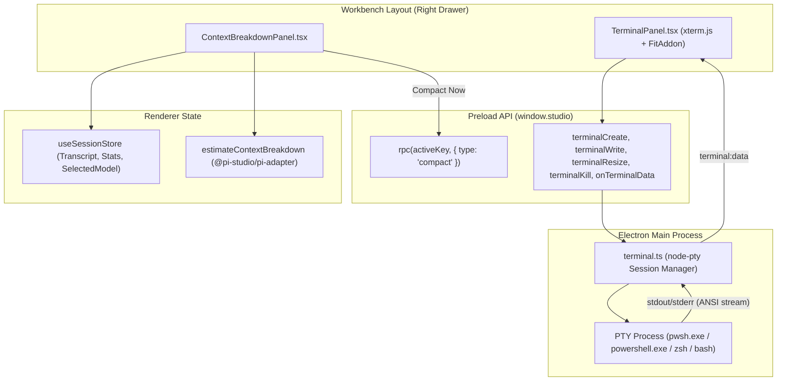

<!-- SUMMARY -->
# Implementation Plan: Context Breakdown Drawer & Integrated Terminal (Executive Summary)

> [!NOTE]
> **Executive Summary**: We will implement the two missing Studio workbench features: (1) a dedicated **Context Breakdown Panel** in the right drawer with real-time category splits, auto-compaction threshold markers, top token consumers, and a "Compact Now" action, and (2) a high-performance **Integrated Terminal** powered by `node-pty` and `@xterm/xterm` featuring multi-tab support, shell auto-detection (PowerShell/pwsh/zsh/bash), quick actions, and direct integration with the Files panel "Run with interpreter" runner.

## High-Level Strategy & Architecture
- **Context Breakdown (`ContextBreakdownPanel.tsx`)**: Replace the placeholder in `WorkbenchLayout.tsx` with a full-height interactive inspector. It pulls live token metrics and transcripts from `useSessionStore()`, runs `@pi-studio/pi-adapter`'s `estimateContextBreakdown`, displays category progress bars (System prompt, User, Assistant, Thinking, Tools, Media), lists the top token offenders, shows the auto-compact threshold mark, and includes a live "Compact Now" button triggering `window.studio.rpc(activeKey, { type: "compact" })`.
- **Integrated Terminal Backend (`apps/desktop/src/main/terminal.ts`)**: A robust PTY manager using `node-pty` (tested and verified compatible with Electron 35) with fallback shell support. Exposes IPC channels for creating, resizing, writing to, and terminating PTY sessions across project directories.
- **Typed Protocol & Preload (`packages/protocol/src/ipc.ts`, `apps/desktop/src/preload/index.ts`)**: Define `terminalCreate`, `terminalWrite`, `terminalResize`, `terminalKill`, `terminalList`, `evtTerminalData`, and `evtTerminalExit`.
- **Interactive Terminal UI (`TerminalPanel.tsx`)**: Embed `@xterm/xterm` with `@xterm/addon-fit` into the right workbench drawer. Includes multi-tab terminal management, Studio dark theme styling, auto-fit on drawer resize, quick command triggers (`pi`, `git status`, `npm test`), and routing from the Files panel "Run with Interpreter".

## Key Decisions

> [!CHOICE] D1 — Terminal Execution Engine
> **Question**: Which backend engine should power the integrated terminal?
> - (x) **Option A**: `node-pty` native pseudoterminal with fallback shell spawn. (Delivers true interactive CLI ergonomics, full ANSI/VT100 escape handling, curses/vim support, tested working in Electron 35) [Recommended]
> - ( ) **Option B**: Basic `child_process.spawn` with piped stdio. (Breaks interactive prompts, curses, arrow keys, and tab completion)

> [!CHOICE] D2 — Context Breakdown UI Location & Structure
> **Question**: How should Context Breakdown be exposed in the UI?
> - (x) **Option A**: Dedicated right drawer panel (`ContextBreakdownPanel`) plus keeping the quick modal popover from Composer. (Allows persistent monitoring while coding as well as instant popover check) [Recommended]
> - ( ) **Option B**: Modal popover only, removing the right activity bar item. (Disrupts user workflow by forcing a modal dialog every time)

## Execution Milestones
- [ ] 1. Context Breakdown Panel: Implement `ContextBreakdownPanel.tsx` and wire into `WorkbenchLayout.tsx`
- [ ] 2. Terminal IPC Backend: Create `apps/desktop/src/main/terminal.ts` with `node-pty` session lifecycle and wire handlers in `main/index.ts`
- [ ] 3. Protocol & Preload Contracts: Update `packages/protocol/src/ipc.ts` and `apps/desktop/src/preload/index.ts` with typed terminal APIs
- [ ] 4. Terminal UI Component: Build `TerminalPanel.tsx` with `@xterm/xterm`, `@xterm/addon-fit`, tab manager, quick commands, and theme styling
- [ ] 5. Runner Integration & Drawer Polish: Connect Files panel "Run with interpreter" to the integrated terminal and test drawer toggle
- [ ] 6. Verification & Test Suite: Validate TypeScript compilation, unit tests, and terminal process execution
<!-- /SUMMARY -->

<!-- FULL -->
# Implementation Plan: Context Breakdown Drawer & Integrated Terminal (Full Technical Specification)

## 1. Objective & Current Deficiencies
In `WorkbenchLayout.tsx`, the right activity bar provides three icons: Marketplace, Context Breakdown, and Terminal. While Marketplace is fully functional, clicking Context Breakdown or Terminal displays static placeholder text:
- **Context Breakdown**: Currently displays a simple message telling the user to click the context ring in the status bar instead of rendering the rich token analysis and compaction controls inside the panel.
- **Terminal**: Currently displays static text without any functional terminal or shell integration. Users have no built-in way to run commands, monitor processes, or run files with interpreters.

This specification implements both features natively inside Pi Studio.

## 2. Architecture & Data Flow



## 3. Decisions & Trade-Offs

> [!CHOICE] D1 — Terminal Execution Engine
> **Question**: Which backend engine should power the integrated terminal?
> - (x) **Option A**: `node-pty` native pseudoterminal with fallback shell spawn. (Delivers true interactive CLI ergonomics, full ANSI/VT100 escape handling, curses/vim support, tested working in Electron 35) [Recommended]
> - ( ) **Option B**: Basic `child_process.spawn` with piped stdio. (Breaks interactive prompts, curses, arrow keys, and tab completion)

> [!CHOICE] D2 — Context Breakdown UI Location & Structure
> **Question**: How should Context Breakdown be exposed in the UI?
> - (x) **Option A**: Dedicated right drawer panel (`ContextBreakdownPanel`) plus keeping the quick modal popover from Composer. (Allows persistent monitoring while coding as well as instant popover check) [Recommended]
> - ( ) **Option B**: Modal popover only, removing the right activity bar item. (Disrupts user workflow by forcing a modal dialog every time)

## 4. Detailed Component Implementation

### 4.1 Context Breakdown Panel (`apps/desktop/src/renderer/components/ContextBreakdownPanel.tsx`)
1. **Header**:
   - Icon: `<PieChart size={16} color="var(--accent-base)" />`
   - Title: "Context Breakdown"
   - Close drawer button (`onClose`).
2. **Context Meter**:
   - Total Tokens: `contextTokens.toLocaleString() / contextWindow.toLocaleString()`
   - Percentage usage badge.
   - Dynamic bar with three states:
     - Normal (< 50%): Accent / Cyan
     - Warning (50%–80%): Amber / Yellow
     - Critical (> 80%): Red
   - Compaction threshold marker at ~85%.
3. **Category Breakdown**:
   - System Prompt (preamble, tools, rules, skills, cwd)
   - User Messages
   - Assistant Responses
   - Reasoning / Thinking blocks
   - Tool Invocations & Tool Output
   - Media / Images
   - Percentage share and token quantity for each category with colored segment bars.
4. **Top Offenders (Largest Context Consumers)**:
   - Ranked list of largest entries (e.g. large file reads, extensive command outputs).
   - Shows label, token size, and percentage of overall context.
5. **Actions**:
   - "Compact Now" button: Triggers `rpc(activeKey, { type: "compact" })` with loading spinner.

### 4.2 Terminal Backend (`apps/desktop/src/main/terminal.ts`)
1. **PtySession Interface**:
   ```typescript
   export interface PtySession {
     id: string;
     ptyProcess: any;
     cwd: string;
     shell: string;
   }
   ```
2. **PtyManager Class**:
   - `create(options: { id?: string; cwd?: string; shell?: string; cols?: number; rows?: number }): PtySession`
     - Auto-selects shell: On Windows, checks `pwsh.exe` then `powershell.exe` then `cmd.exe`. On macOS/Linux, checks `process.env.SHELL` or `/bin/zsh` / `/bin/bash`.
     - Sets environment variables: `TERM: "xterm-256color"`, `COLORTERM: "truecolor"`.
     - Hooks `ptyProcess.onData` -> forwards to `BrowserWindow` via `IPC.evtTerminalData`.
     - Hooks `ptyProcess.onExit` -> forwards to `BrowserWindow` via `IPC.evtTerminalExit`.
   - `write(id: string, data: string): void`
   - `resize(id: string, cols: number, rows: number): void`
   - `kill(id: string): void`
   - `list(): { id: string; shell: string; cwd: string }[]`
   - Clean shutdown: Disposes all sessions on Electron `app.on("before-quit")`.

### 4.3 Protocol & Preload Bridge
1. **`packages/protocol/src/ipc.ts`**:
   - Channels:
     - `terminalCreate: "terminal:create"`
     - `terminalWrite: "terminal:write"`
     - `terminalResize: "terminal:resize"`
     - `terminalKill: "terminal:kill"`
     - `terminalList: "terminal:list"`
     - `evtTerminalData: "terminal:data"`
     - `evtTerminalExit: "terminal:exit"`
   - StudioApi additions:
     - `terminalCreate(options?: { cwd?: string; shell?: string; cols?: number; rows?: number }): Promise<{ id: string; shell: string; cwd: string }>`
     - `terminalWrite(id: string, data: string): Promise<void>`
     - `terminalResize(id: string, cols: number, rows: number): Promise<void>`
     - `terminalKill(id: string): Promise<void>`
     - `terminalList(): Promise<{ id: string; shell: string; cwd: string }[]>`
     - `onTerminalData(listener: (event: { id: string; data: string }) => void): () => void`
     - `onTerminalExit(listener: (event: { id: string; exitCode: number }) => void): () => void`
2. **`apps/desktop/src/preload/index.ts`**:
   - Expose all terminal methods through `window.studio`.

### 4.4 Terminal UI Component (`apps/desktop/src/renderer/components/TerminalPanel.tsx`)
1. **Terminal Tab Header**:
   - Multiple tabs support with active tab highlighting.
   - "+ New Terminal" button.
   - Close tab button (`X`).
   - Quick action shortcuts: "Clear", "Restart", and quick commands (`pi`, `git status`, `npm test`).
2. **xterm.js Canvas Container**:
   - Initializes `Terminal` from `@xterm/xterm` with `@xterm/addon-fit`.
   - Theme configuration matching Pi Studio:
     - `background: "var(--bg-base)"` or `#131418`
     - `foreground: "#e2e8f0"`
     - `cursor: "var(--accent-base)"`
     - `selectionBackground: "rgba(99, 102, 241, 0.3)"`
   - Listens to `term.onData(data => window.studio.terminalWrite(activeId, data))`.
   - Subscribes to `window.studio.onTerminalData(evt => { if (evt.id === activeId) term.write(evt.data); })`.
   - Resize handling via `ResizeObserver` calling `fitAddon.fit()` and sending `terminalResize`.

### 4.5 Runner Integration
1. In `FilesPanel.tsx` or file context menu:
   - When user clicks "Run with interpreter" on a file, allow sending the execution command directly into the active terminal tab (`window.studio.terminalWrite(termId, cmd + "\r")`) and auto-switching the right drawer to `terminal`.
   - Gives the user live streaming terminal execution rather than just static buffer capture.

## 5. File Changes Breakdown

| File | Status | Description |
|---|---|---|
| `packages/protocol/src/ipc.ts` | Modified | Add typed terminal channels and StudioApi interface methods |
| `apps/desktop/src/main/terminal.ts` | New | `node-pty` terminal session manager with process lifecycle management |
| `apps/desktop/src/main/index.ts` | Modified | Wire terminal IPC handlers to `terminal.ts` |
| `apps/desktop/src/preload/index.ts` | Modified | Expose `terminalCreate`, `terminalWrite`, `terminalResize`, `terminalKill`, `onTerminalData`, `onTerminalExit` |
| `apps/desktop/src/renderer/components/ContextBreakdownPanel.tsx` | New | Rich context breakdown drawer panel with token bars, categories, and compact button |
| `apps/desktop/src/renderer/components/TerminalPanel.tsx` | New | Interactive xterm.js terminal with tab bar, quick commands, and fit addon |
| `apps/desktop/src/renderer/components/WorkbenchLayout.tsx` | Modified | Render `ContextBreakdownPanel` and `TerminalPanel` in right drawer |
| `apps/desktop/src/main/terminal.test.ts` | New | Unit tests for terminal manager lifecycle and command dispatch |

## 6. Verification Strategy
1. **Type Checking**:
   - Run `npm run typecheck` across all workspaces to guarantee strict TypeScript compliance.
2. **Unit Tests**:
   - Run `npm test` to verify existing and new tests pass.
3. **Interactive Verification**:
   - Open Studio, open Context Breakdown tab: inspect token count, progress bar, categories, top items, and click "Compact Now".
   - Open Terminal tab: create new terminal, verify PowerShell/bash prompt loads, type commands (`dir`, `ls`, `git status`), verify terminal output renders with ANSI formatting, test tab switching, test terminal resize.
